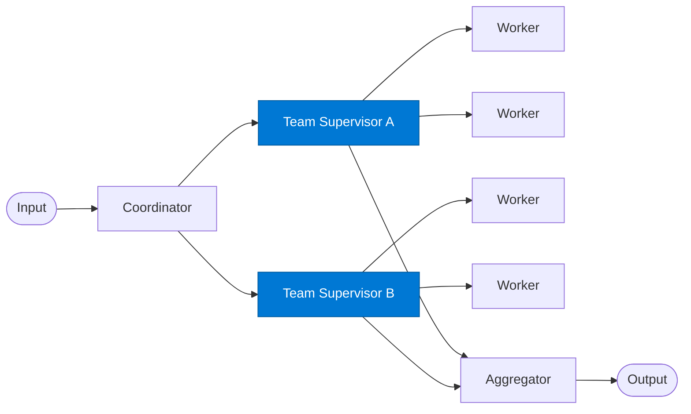

# Team Supervisor

_Manages the workers within a single specialist team and returns the team's result._

## Overview

The Team Supervisor sits one level below the Coordinator. It receives a sub-task, breaks it into individual work items for its team's workers, oversees their execution, and synthesises the team's contribution. Each team supervisor is scoped to a domain (e.g. `finance_team`, `legal_team`).

## Pattern Diagram



## Contract Specification

### Inputs

**team_assignment** (object, required):
- `team` (string, required): This team's identifier
- `sub_task` (string, required): What the team must accomplish
- `context` (object, optional): Shared context from the coordinator
- `deadline_iso` (string, optional)

### Outputs

**team_result** (object):
- `team` (string): Matches input
- `result` (object, required): Team's contribution
- `status` (string): `"complete"` | `"partial"` | `"blocked"`
- `blockers` (array, optional): Issues that prevented full completion

## Azure Tools

| Tool ID | Display Name | Service | Purpose in this role |
|---|---|---|---|
| `iq-foundry` | Foundry IQ | Indexed org knowledge via Azure AI Search | Team-specific knowledge domain (each team supervisor has its own index) |
| `iq-fabric` | Fabric IQ | OneLake, Power BI semantic models and datasets | Team needs to query business / analytics data as part of its work |

## Usage

```python
from safe_framework.agents.patterns.hierarchical_teams.team_supervisor import TeamSupervisor

sup = TeamSupervisor(kernel=kernel, team="finance_team")
result = await sup.invoke({
    "team": "finance_team",
    "sub_task": "Model Q3 revenue projections under three growth scenarios"
})
```

## Use Cases

1. **Finance team** — financial modelling, budget analysis, cost projections
2. **Legal team** — contract review, compliance checks, risk assessment
3. **Technical team** — architecture review, code analysis, infrastructure scoping

## Limitations

- Team supervisors are domain-scoped; they cannot delegate to other teams
- Blockers must be surfaced clearly so the aggregator can handle partial results

## Related Roles

- **Coordinator** — assigns sub-tasks to this supervisor
- **Aggregator** — collects team results after all supervisors complete

---

**Status:** Production Ready  
**Version:** 1.0  
**Framework:** SAFE 1.0  
**Last Updated:** 2026-06-21
