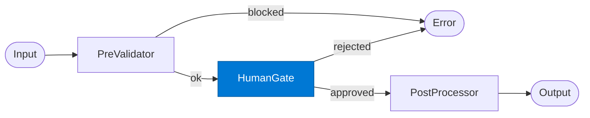

# HITL Human Gate

_Suspends the workflow and waits for a human approval or rejection before proceeding._

## Overview

The HITL Human Gate is the **human_gate** role in the **human-in-the-loop** pattern. It ensures that human judgment is incorporated at a defined checkpoint before the workflow proceeds.

## Pattern Diagram



## Contract Specification

### Inputs
**payload** (object, required): Original request  
**pre_validation** (object, required): Pre-validator output  


### Outputs
**decision** (string): 'approved' or 'rejected'  
**approver** (string): Identity of the human reviewer  
**reason** (string): Optional rejection reason  
**timestamp_iso** (string): When the decision was made  


## Azure Tools

| Tool ID | Display Name | Service | Purpose in this role |
|---|---|---|---|
| `safe-durable-task` | SAFE Durable Task | Checkpoint / suspend / resume long-running workflows | Suspend workflow and resume on webhook callback from human reviewer |

## Usage

```python
from safe_framework.agents.patterns.human_in_the_loop.human_gate import HITLHumanGate

agent = HITLHumanGate(kernel=kernel)
result = await agent.invoke({{payload: {}, pre_validation: {}}})
```

## Use Cases

1. **Budget approval**
2. **Contract sign-off**
3. **Compliance decision**


## Limitations

- `human_gate` suspends indefinitely — set a timeout in SAFE Durable Task config
- Requires the human reviewer to have access to the Durable Task management UI or webhook

## Related Roles

- **Pre-Validator** → **Human Gate** → **Post-Processor** is the approval chain
- See also: `checkpoint-resume` for automated (non-human) pause/resume

---

**Status:** Production Ready  
**Version:** 1.0  
**Framework:** SAFE 1.0  
**Last Updated:** 2026-06-21
