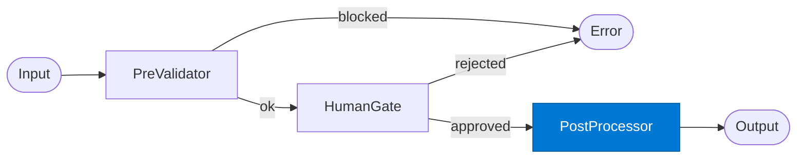

# HITL Post-Processor

_Completes the workflow after human approval, logging the decision back to the compliance record._

## Overview

The HITL Post-Processor is the **post_processor** role in the **human-in-the-loop** pattern. It ensures that human judgment is incorporated at a defined checkpoint before the workflow proceeds.

## Pattern Diagram



## Contract Specification

### Inputs
**payload** (object, required): Original approved request  
**gate_result** (object, required): Human gate decision and metadata  


### Outputs
**result** (object): Final processed output  
**audit_id** (string): Compliance audit record ID  


## Azure Tools

| Tool ID | Display Name | Service | Purpose in this role |
|---|---|---|---|
| `iq-work` | Work IQ | M365 signals — meetings, chats, emails, documents | Log decision back to M365 compliance record in SharePoint |

## Usage

```python
from safe_framework.agents.patterns.human_in_the_loop.post_processor import HITLPost-Processor

agent = HITLPost-Processor(kernel=kernel)
result = await agent.invoke({{payload: {}, gate_result: {}}})
```

## Use Cases

1. **Post-approval processing**
2. **Audit record creation**
3. **Downstream automation trigger**


## Limitations

- `human_gate` suspends indefinitely — set a timeout in SAFE Durable Task config
- Requires the human reviewer to have access to the Durable Task management UI or webhook

## Related Roles

- **Pre-Validator** → **Human Gate** → **Post-Processor** is the approval chain
- See also: `checkpoint-resume` for automated (non-human) pause/resume

---

**Status:** Production Ready  
**Version:** 1.0  
**Framework:** SAFE 1.0  
**Last Updated:** 2026-06-21
