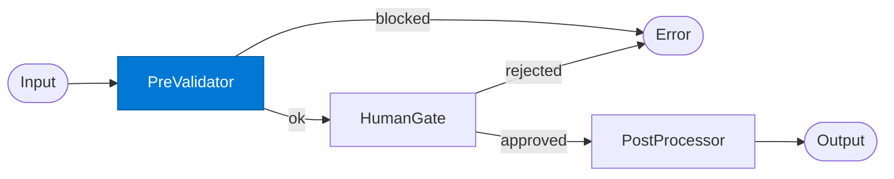

# HITL Pre-Validator

_Validates the request before it is sent to the human review gate._

## Overview

The HITL Pre-Validator is the **pre_validator** role in the **human-in-the-loop** pattern. It ensures that human judgment is incorporated at a defined checkpoint before the workflow proceeds.

## Pattern Diagram



## Contract Specification

### Inputs
**payload** (object, required): Request to validate  


### Outputs
**approved_for_human_review** (boolean): Whether the request passes pre-checks  
**reason** (string): Reason if blocked  
**metadata** (object): Validation metadata  


## Azure Tools

| Tool ID | Display Name | Service | Purpose in this role |
|---|---|---|---|
| `iq-foundry` | Foundry IQ | Indexed org knowledge via Azure AI Search | Look up approval policy for this request type |

## Usage

```python
from safe_framework.agents.patterns.human_in_the_loop.pre_validator import HITLPre-Validator

agent = HITLPre-Validator(kernel=kernel)
result = await agent.invoke({{payload: {}}})
```

## Use Cases

1. **PII scan before human review**
2. **Completeness check**
3. **Compliance pre-screen**


## Limitations

- `human_gate` suspends indefinitely — set a timeout in SAFE Durable Task config
- Requires the human reviewer to have access to the Durable Task management UI or webhook

## Related Roles

- **Pre-Validator** → **Human Gate** → **Post-Processor** is the approval chain
- See also: `checkpoint-resume` for automated (non-human) pause/resume

---

**Status:** Production Ready  
**Version:** 1.0  
**Framework:** SAFE 1.0  
**Last Updated:** 2026-06-21
