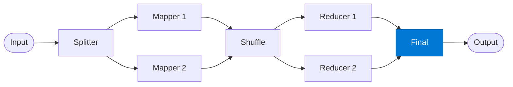

# Final Merger

_Combines all reducer outputs into the single map-reduce result._

## Overview

The Final agent is the last stage of the **map-reduce** pattern. It receives one `(key, result)` pair from every reducer and merges them into the canonical output. It also performs a final validation pass to ensure the merged result conforms to the expected output contract.

## Pattern Diagram



## Contract Specification

### Inputs

**reducer_results** (array, required):
- Each element: `{ "key": str, "result": any, "count": integer }`

### Outputs

**final_output** (object):
- `results` (object): Key → reduced value map
- `total_keys` (integer): Number of distinct keys
- `total_records` (integer): Sum of all `count` values
- `summary` (string): Natural-language summary of findings

## Azure Tools

| Tool ID | Display Name | Service | Purpose in this role |
|---|---|---|---|
| `iq-foundry` | Foundry IQ | Indexed org knowledge via Azure AI Search | Validate final output against business rules and known patterns |

## Usage

```python
from safe_framework.agents.patterns.map_reduce.final import FinalMerger

agent = FinalMerger(kernel=kernel)
output = await agent.invoke({"reducer_results": all_reducer_outputs})
```

## Use Cases

1. **Revenue consolidation** — merge region totals into a global P&L summary
2. **Classification report** — produce a final distribution across all categories
3. **Entity inventory** — build a complete entity list from per-key extractions

## Limitations

- Does not re-reduce: if two reducer keys should be merged, do it in the reducers
- Output size is bounded by the number of unique keys

## Related Roles

- **Reducer** — each reducer contributes one `(key, result)` pair to this role
- **Splitter** — first stage; its partitioning strategy affects final key distribution

---

**Status:** Production Ready  
**Version:** 1.0  
**Framework:** SAFE 1.0  
**Last Updated:** 2026-06-21
