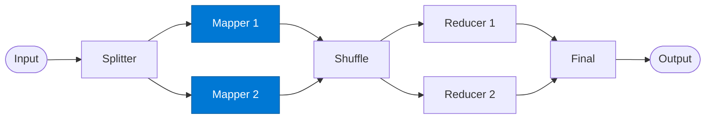

# Mapper

_Transforms each input chunk into a set of key-value pairs._

## Overview

The Mapper applies a user-defined transformation to every record in its assigned chunk, emitting `(key, value)` pairs. All mappers run in parallel. The key determines which reducer receives each pair in the shuffle step.

## Pattern Diagram



## Contract Specification

### Inputs

**chunk** (object, required):
- `chunk_id` (string, required)
- `items` (array, required): Records to map
- `key` (string): Inherited key hint from splitter

### Outputs

**mapped_pairs** (array):
- Each element: `{ "key": str, "value": any, "chunk_id": str }`

## Azure Tools

| Tool ID | Display Name | Service | Purpose in this role |
|---|---|---|---|
| `iq-foundry` | Foundry IQ | Indexed org knowledge via Azure AI Search | Enrich each chunk with contextual knowledge (entity lookup, classification rules) |
| `iq-web` | Web IQ | Live public web and news via Bing grounding | Live external lookup per record when mapping requires it |

## Usage

```python
from safe_framework.agents.patterns.map_reduce.mapper import Mapper

agent = Mapper(kernel=kernel)
pairs = await agent.invoke({
    "chunk_id": "chunk-001",
    "items": records[:100],
    "key": "category"
})
```

## Use Cases

1. **Word frequency** — emit `(word, 1)` for every word in a text chunk
2. **Category classification** — classify each record and emit `(category, record)`
3. **Entity extraction** — extract entities and emit `(entity_type, entity_name)`

## Limitations

- Each mapper is stateless — cannot share state with other mapper instances
- Emitted keys must be strings for reliable shuffle grouping

## Related Roles

- **Splitter** — provides input chunks
- **Shuffle** — groups mapper output before reduction

---

**Status:** Production Ready  
**Version:** 1.0  
**Framework:** SAFE 1.0  
**Last Updated:** 2026-06-21
