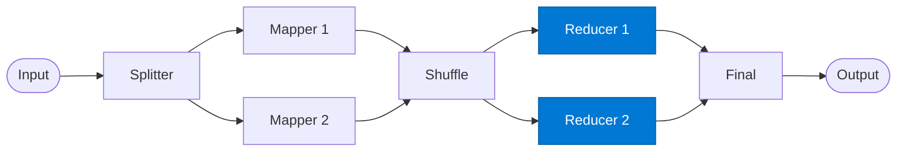

# Reducer

_Aggregates all values for a single key into a single reduced value._

## Overview

Each Reducer receives one group of `(key, values[])` and collapses them into a single `(key, result)` pair. Multiple reducers run in parallel, each owning a disjoint set of keys. The Final agent then merges all reducer outputs.

## Pattern Diagram



## Contract Specification

### Inputs

**group** (object, required):
- `reducer_id` (string, required)
- `key` (string, required): The grouping key
- `values` (array, required): All values emitted for this key by mappers

### Outputs

**reduced_result** (object):
- `key` (string): Same key as input
- `result` (any, required): The aggregated value
- `count` (integer): Number of values aggregated

## Azure Tools

| Tool ID | Display Name | Service | Purpose in this role |
|---|---|---|---|
| `iq-foundry` | Foundry IQ | Indexed org knowledge via Azure AI Search | Validate reduced output against business rules before returning |

## Usage

```python
from safe_framework.agents.patterns.map_reduce.reducer import Reducer

agent = Reducer(kernel=kernel)
result = await agent.invoke({
    "reducer_id": "r-001",
    "key": "north_america",
    "values": [120.5, 88.3, 201.0]
})
# result["result"] → 409.8
```

## Use Cases

1. **Sum / count** — total all values for a key (e.g. revenue by region)
2. **Sentiment roll-up** — average sentiment scores per category
3. **Top-N selection** — return the top 10 items by score within each key

## Limitations

- Works on a single key group — does not cross-reference other keys
- Very large `values` arrays may exceed context; consider streaming reduce

## Related Roles

- **Shuffle** — assigns key groups to reducers
- **Final** — merges all reducer outputs into the single result

---

**Status:** Production Ready  
**Version:** 1.0  
**Framework:** SAFE 1.0  
**Last Updated:** 2026-06-21
