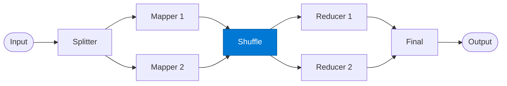

# Shuffle / Sort

_Groups mapper output by key and distributes groups to reducers._

## Overview

The Shuffle stage collects all `(key, value)` pairs from the mappers, groups them by key, and assigns each group to a reducer. This is the coordination hub of the map-reduce pattern — it ensures each reducer receives all values for its assigned keys.

## Pattern Diagram



## Contract Specification

### Inputs

**mapped_pairs** (array, required):
- Each element: `{ "key": str, "value": any, "chunk_id": str }`

### Outputs

**reducer_groups** (array):
- Each element: `{ "reducer_id": str, "key": str, "values": array }`
- `total_groups` (integer)

## Azure Tools

| Tool ID | Display Name | Service | Purpose in this role |
|---|---|---|---|
| `iq-fabric` | Fabric IQ | OneLake, Power BI semantic models and datasets | Reorder/shuffle structured data sourced from OneLake |

## Usage

```python
from safe_framework.agents.patterns.map_reduce.shuffle import ShuffleSorter

agent = ShuffleSorter(kernel=kernel)
groups = await agent.invoke({"mapped_pairs": all_pairs})
```

## Use Cases

1. **Grouping for aggregation** — group all sales records by `region` before summing
2. **Balanced reducer assignment** — distribute keys evenly across N reducers
3. **Sort-merge** — sort all pairs by key before handing to reducers

## Limitations

- Holds all mapper output in memory during grouping — may be large for big datasets
- Reducer assignment is round-robin; uneven key distributions cause reducer skew

## Related Roles

- **Mapper** — provides the key-value pairs this role groups
- **Reducer** — receives grouped values from this role

---

**Status:** Production Ready  
**Version:** 1.0  
**Framework:** SAFE 1.0  
**Last Updated:** 2026-06-21
