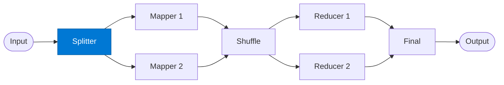

# Input Splitter

_Partitions the input dataset into equal-sized chunks for parallel mapping._

## Overview

The Splitter is the first stage of the **map-reduce** pattern. It receives the full input and produces N independent chunks, each assigned a `chunk_id` and a `key` used for the shuffle grouping step. The split is deterministic: same input always produces the same chunks.

## Pattern Diagram



## Contract Specification

### Inputs

**dataset** (object, required):
- `items` (array, required): The records to process
- `chunk_size` (integer, optional): Target records per chunk (default: 100)
- `key_field` (string, optional): Field used to derive map keys

### Outputs

**chunks** (array):
- Each element: `{ "chunk_id": str, "items": array, "key": str }`
- `total_chunks` (integer)

## Azure Tools

| Tool ID | Display Name | Service | Purpose in this role |
|---|---|---|---|
| `iq-fabric` | Fabric IQ | OneLake, Power BI semantic models and datasets | Split directly from OneLake / Power BI data model instead of pre-loading |
| `azure-cosmos-db` | Azure Cosmos DB | Vector + document store; hybrid search | Split from an operational database — query chunk boundaries, stream records |

## Usage

```python
from safe_framework.agents.patterns.map_reduce.splitter import InputSplitter

agent = InputSplitter(kernel=kernel)
chunks = await agent.invoke({
    "items": records,
    "chunk_size": 50,
    "key_field": "category"
})
```

## Use Cases

1. **Large dataset processing** — split 50,000 records into 500 chunks of 100
2. **Keyed aggregation** — split by `category` so all same-category records reduce together
3. **OneLake partitioning** — stream partition boundaries directly from Fabric IQ

## Limitations

- Chunks must fit in memory; very large records may need streaming
- Key distribution must be reasonably uniform to avoid reducer skew

## Related Roles

- **Mapper** — receives each chunk from this role
- **Shuffle** — groups mapped output by key before reducing

---

**Status:** Production Ready  
**Version:** 1.0  
**Framework:** SAFE 1.0  
**Last Updated:** 2026-06-21
