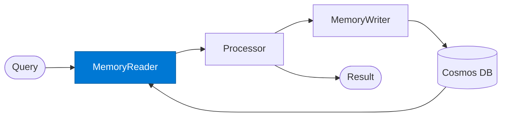

# Memory Reader

_Retrieves relevant memories for the current session from the vector store._

## Overview

The Memory Reader is the **memory_reader** role in the **memory-augmented** pattern — agents read from and write to a shared memory store (Azure Cosmos DB) to preserve context across multiple turns or sessions.

## Pattern Diagram

## Contract Specification

### Inputs
**session_id** (string, required): Session or user identifier  
**query** (string, required): Current query for semantic memory retrieval  

### Outputs
**memories** (array): Relevant past memories with semantic scores  
**session_context** (object): Aggregated session context  

## Azure Tools

| Tool ID | Display Name | Service | Purpose in this role |
|---|---|---|---|
| `azure-cosmos-db` | Azure Cosmos DB | Vector + document store; hybrid search | Hybrid + vector search over stored episodic/semantic memories |

## Use Cases

1. **Multi-turn conversation context**
2. **Long-running project state**
3. **Personalised recommendations**

## Limitations

- Memory retrieval uses semantic search — exact recall is not guaranteed
- Old memories should be pruned or summarised to avoid stale context accumulation

## Related Roles

- **Memory Reader** → **Processor** → **Memory Writer** is the read-process-write loop
- See also: `checkpoint-resume` for workflow state (not semantic memory) persistence

---

**Status:** Production Ready  
**Version:** 1.0  
**Framework:** SAFE 1.0  
**Last Updated:** 2026-06-21
