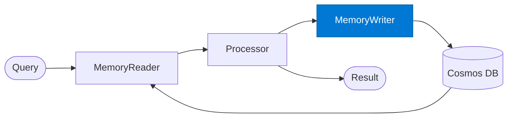

# Memory Writer

_Persists new memories and updated session state to the vector store after processing._

## Overview

The Memory Writer is the **memory_writer** role in the **memory-augmented** pattern — agents read from and write to a shared memory store (Azure Cosmos DB) to preserve context across multiple turns or sessions.

## Pattern Diagram



## Contract Specification

### Inputs
**session_id** (string, required): Session identifier  
**new_memories** (array, required): Memories produced by the processor  
**result** (object, required): Full processing result for metadata storage  


### Outputs
**stored_count** (integer): Number of memories successfully persisted  
**memory_ids** (array): IDs of stored memory documents  


## Azure Tools

| Tool ID | Display Name | Service | Purpose in this role |
|---|---|---|---|
| `azure-cosmos-db` | Azure Cosmos DB | Vector + document store; hybrid search | Persist episodic/semantic memories with vector embeddings |


## Usage

```python
from safe_framework.safe_core.code_generator import RouteCodeGenerator
from safe_framework.safe_core.models import RouteDefinition, RoutePattern, Agent

route = RouteDefinition(
    name="my-route",
    pattern=RoutePattern.MEMORY_AUGMENTED,
    agents={"memory_writer": Agent(
        name="Memory Writer",
        category="test",
        version="1.0",
        input_schema={"type": "object", "properties": {}},
        output_schema={"type": "object", "properties": {}},
    )},
    description="Example route using this role",
)
generated = RouteCodeGenerator.generate(route)
```

## Use Cases

1. **Session state persistence**
2. **Long-running project memory**
3. **User preference storage**


## Limitations

- Memory retrieval uses semantic search — exact recall is not guaranteed
- Old memories should be pruned or summarised to avoid stale context accumulation

## Related Roles

- **Memory Reader** → **Processor** → **Memory Writer** is the read-process-write loop
- See also: `checkpoint-resume` for workflow state (not semantic memory) persistence

---

**Status:** Production Ready  
**Version:** 1.0  
**Framework:** SAFE 1.0  
**Last Updated:** 2026-06-21
