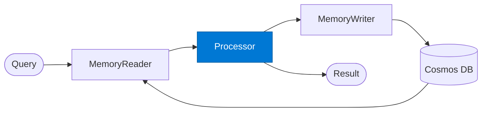

# Memory Processor

_Processes the request enriched with recalled memories, and produces new memories for storage._

## Overview

The Memory Processor is the **processor** role in the **memory-augmented** pattern — agents read from and write to a shared memory store (Azure Cosmos DB) to preserve context across multiple turns or sessions.

## Pattern Diagram



## Contract Specification

### Inputs
**query** (string, required): Current query  
**memories** (array, required): Recalled memories from memory reader  
**context** (object, optional): Additional context  


### Outputs
**result** (object): Processing output grounded in recalled memories  
**new_memories** (array): New memory objects to persist for future recall  


## Azure Tools

| Tool ID | Display Name | Service | Purpose in this role |
|---|---|---|---|
| `iq-foundry` | Foundry IQ | Indexed org knowledge via Azure AI Search | Combine recalled memory with authoritative org knowledge |


## Usage

```python
from safe_framework.safe_core.code_generator import RouteCodeGenerator
from safe_framework.safe_core.models import RouteDefinition, RoutePattern, Agent

route = RouteDefinition(
    name="my-route",
    pattern=RoutePattern.MEMORY_AUGMENTED,
    agents={"processor": Agent(
        name="Processor",
        category="test",
        version="1.0",
        input_schema={"type": "object", "properties": {}},
        output_schema={"type": "object", "properties": {}},
    )},
    description="Example route using this role",
)
generated = RouteCodeGenerator.generate(route)
```

## Use Cases

1. **Context-aware Q&A**
2. **Personalised recommendations**
3. **Long-running workflow continuation**


## Limitations

- Memory retrieval uses semantic search — exact recall is not guaranteed
- Old memories should be pruned or summarised to avoid stale context accumulation

## Related Roles

- **Memory Reader** → **Processor** → **Memory Writer** is the read-process-write loop
- See also: `checkpoint-resume` for workflow state (not semantic memory) persistence

---

**Status:** Production Ready  
**Version:** 1.0  
**Framework:** SAFE 1.0  
**Last Updated:** 2026-06-21
