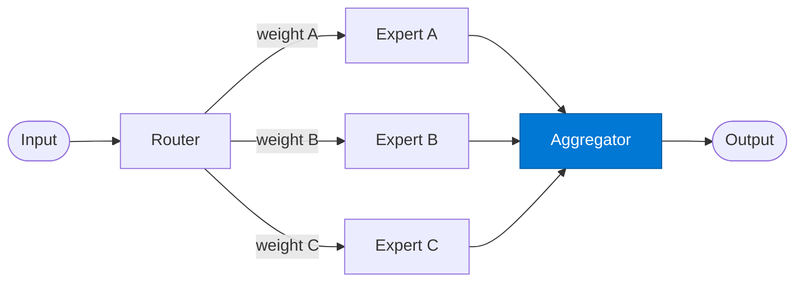

# Expert Aggregator

_Blends multiple expert answers using their routing weights and confidence scores._

## Overview

The Aggregator receives answers from all activated experts and synthesises them into a single response. It uses the weight × confidence product to blend answers — higher-weight experts with high confidence dominate the output. It also generates a citation list from all expert sources.

## Pattern Diagram



## Contract Specification

### Inputs

**expert_answers** (array, required):
- Each element: `{ "expert_key": str, "answer": str, "confidence": float, "weight": float, "sources": array }`

### Outputs

**blended_result** (object):
- `answer` (string, required): Synthesised response
- `expert_contributions` (array): `{ "expert_key": str, "blend_score": float }`
- `sources` (array): Deduplicated list of all references
- `dominant_expert` (string): Expert with highest blend score

## Azure Tools

| Tool ID | Display Name | Service | Purpose in this role |
|---|---|---|---|
| `iq-foundry` | Foundry IQ | Indexed org knowledge via Azure AI Search | Ground the final expert synthesis in authoritative source material |

## Usage

```python
from safe_framework.agents.patterns.mixture_of_experts.aggregator import ExpertAggregator

agg = ExpertAggregator(kernel=kernel)
result = await agg.invoke({"expert_answers": answers})
```

## Use Cases

1. **Multi-expert synthesis** — blend legal + finance perspectives on a deal
2. **Confidence-weighted voting** — let the most confident expert dominate
3. **Source consolidation** — produce a single citation list across all experts

## Limitations

- Requires at least one expert with `confidence > 0`; returns an error if all experts report zero confidence
- Blending prose answers is inherently lossy — contradictions may not be resolved

## Related Roles

- **Router** — activates experts and assigns initial weights
- **Expert** — provides individual answers this role blends

---

**Status:** Production Ready  
**Version:** 1.0  
**Framework:** SAFE 1.0  
**Last Updated:** 2026-06-21
