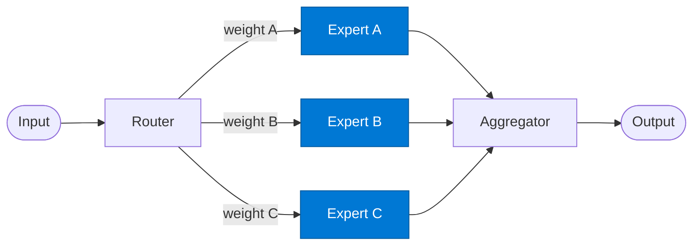

# Domain Expert

_Applies deep domain knowledge to a query and returns a scored answer._

## Overview

Each Expert is a specialist agent scoped to a single domain (e.g. legal, finance, medical, technical). It receives the query along with its assigned routing weight, consults its domain-specific knowledge index, and returns a structured answer with a confidence score. The aggregator uses the weight + confidence to blend multiple expert answers.

## Pattern Diagram



## Contract Specification

### Inputs

**expert_request** (object, required):
- `query` (object, required): The original query
- `expert_key` (string): This expert's identifier (e.g. `"legal"`)
- `weight` (float): Routing weight assigned by the router

### Outputs

**expert_answer** (object):
- `expert_key` (string): Matches input
- `answer` (string, required): Domain-specific response
- `confidence` (float): Expert's self-assessed confidence 0.0–1.0
- `sources` (array): References used from the knowledge index
- `weight` (float): Pass-through for aggregator blending

## Azure Tools

| Tool ID | Display Name | Service | Purpose in this role |
|---|---|---|---|
| `iq-foundry` | Foundry IQ | Indexed org knowledge via Azure AI Search | Domain-specific knowledge index per expert (e.g. legal-expert → legal index) |
| `iq-fabric` | Fabric IQ | OneLake, Power BI semantic models and datasets | When the expert needs to reason over analytical business data |
| `iq-web` | Web IQ | Live public web and news via Bing grounding | When an expert needs current external information (e.g. market-expert) |

## Usage

```python
from safe_framework.agents.patterns.mixture_of_experts.expert import DomainExpert

expert = DomainExpert(kernel=kernel, domain="legal")
answer = await expert.invoke({
    "query": {"text": "Tax implications of the Contoso acquisition?"},
    "expert_key": "legal",
    "weight": 0.7
})
```

## Use Cases

1. **Legal expert** — M&A, contract review, regulatory compliance queries
2. **Finance expert** — valuation, P&L analysis, budget queries
3. **Technical expert** — architecture review, code analysis, API documentation

## Limitations

- Each expert only knows its own domain — do not route cross-domain queries to a single expert
- Confidence score is self-reported; calibration varies by domain

## Related Roles

- **Router** — activates this expert and assigns its weight
- **Aggregator** — blends this expert's output with others

---

**Status:** Production Ready  
**Version:** 1.0  
**Framework:** SAFE 1.0  
**Last Updated:** 2026-06-21
