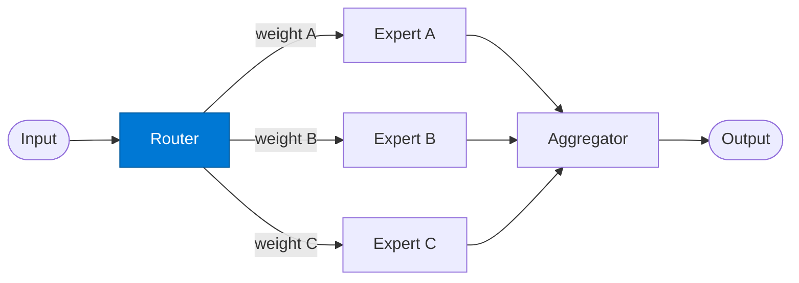

# Expert Router

_Assigns routing weights to experts based on query domain and past performance._

## Overview

The Router classifies the incoming query, scores each registered expert against that classification, and activates the top-K experts (by weight). Unlike a supervisor-manager router that picks one, the mixture-of-experts router may invoke several experts and rely on the aggregator to blend their responses.

## Pattern Diagram



## Contract Specification

### Inputs

**query** (object, required):
- `text` (string, required): The question or task
- `top_k` (integer, optional): Number of experts to activate (default: 2)
- `context` (object, optional): User, team, or session context

### Outputs

**routing_plan** (object):
- `activated_experts` (array): List of `{ "expert_key": str, "weight": float, "reason": str }`
- `query` (object): Original query forwarded to each expert
- `classification` (string): Domain label assigned to this query

## Azure Tools

| Tool ID | Display Name | Service | Purpose in this role |
|---|---|---|---|
| `iq-foundry` | Foundry IQ | Indexed org knowledge via Azure AI Search | Retrieve expert capability descriptions and past routing decisions to assign weights |
| `iq-work` | Work IQ | M365 signals — meetings, chats, emails, documents | Understand the query domain from org signals (which team owns this topic) |

## Usage

```python
from safe_framework.agents.patterns.mixture_of_experts.router import ExpertRouter

router = ExpertRouter(kernel=kernel)
plan = await router.invoke({
    "text": "What are the tax implications of this M&A deal?",
    "top_k": 2
})
# plan["activated_experts"] → [{"expert_key": "legal", "weight": 0.7}, ...]
```

## Use Cases

1. **Multi-domain Q&A** — route finance + legal questions to both experts
2. **Confidence blending** — activate multiple specialists and weight their answers
3. **Adaptive routing** — update expert weights based on feedback stored in Foundry IQ

## Limitations

- Top-K activation increases cost linearly with K
- Expert weights are recalculated on every call — consider caching for high-throughput routes

## Related Roles

- **Expert** — domain specialist activated by this router
- **Aggregator** — blends expert outputs using the weights from this router

---

**Status:** Production Ready  
**Version:** 1.0  
**Framework:** SAFE 1.0  
**Last Updated:** 2026-06-21
