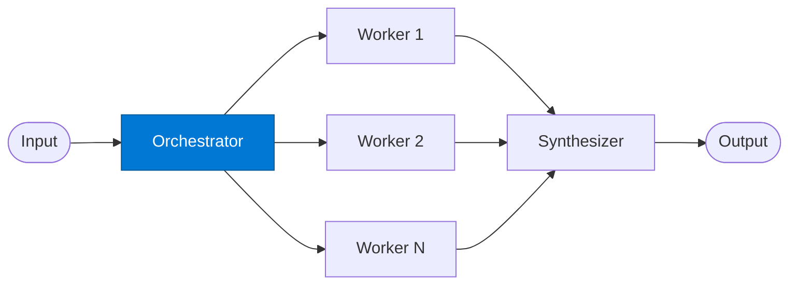

# Task Orchestrator

_Dynamically decomposes an incoming task into subtasks and assigns them to workers._

## Overview

The Task Orchestrator is the **orchestrator** role in the **orchestrator-workers** pattern. Anthropic's internal research shows this pattern achieves ~90% better performance than single-agent on complex multi-step tasks.

## Pattern Diagram



## Contract Specification

### Inputs
**task** (string, required): High-level task description  
**context** (object, optional): Additional context  


### Outputs
**subtasks** (array): List of subtask objects for workers  
**plan_id** (string): Unique plan identifier for tracing  


## Azure Tools

| Tool ID | Display Name | Service | Purpose in this role |
|---|---|---|---|
| `iq-work` | Work IQ | M365 signals — meetings, chats, emails, documents | Understand org context to plan task decomposition |


## Usage

```python
from safe_framework.safe_core.code_generator import RouteCodeGenerator
from safe_framework.safe_core.models import RouteDefinition, RoutePattern, Agent

route = RouteDefinition(
    name="my-route",
    pattern=RoutePattern.ORCHESTRATOR_WORKERS,
    agents={"orchestrator": Agent(
        name="Orchestrator",
        category="test",
        version="1.0",
        input_schema={"type": "object", "properties": {}},
        output_schema={"type": "object", "properties": {}},
    )},
    description="Example route using this role",
)
generated = RouteCodeGenerator.generate(route)
```

## Use Cases

1. **Complex analysis decomposition**
2. **Multi-step report planning**
3. **RFP workstream breakdown**


## Limitations

- Orchestrator decomposition quality determines overall output quality
- Workers are generic; for domain specialists use `mixture-of-experts` instead

## Related Roles

- **Orchestrator** decomposes → **Workers** execute → **Synthesizer** merges

---

**Status:** Production Ready  
**Version:** 1.0  
**Framework:** SAFE 1.0  
**Last Updated:** 2026-06-21
