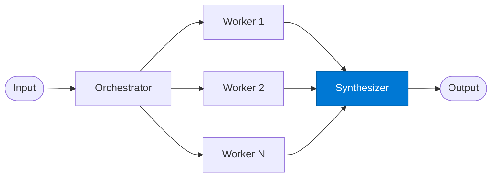

# Result Synthesizer

_Combines all worker subtask results into a unified final output._

## Overview

The Result Synthesizer is the **synthesizer** role in the **orchestrator-workers** pattern. Anthropic's internal research shows this pattern achieves ~90% better performance than single-agent on complex multi-step tasks.

## Pattern Diagram

## Contract Specification

### Inputs
**subtask_results** (array, required): Results from all workers  
**original_request** (object, required): The original orchestrator input  

### Outputs
**synthesis** (object): Unified combined output  
**coverage** (float): Fraction of subtasks that succeeded  

## Azure Tools

| Tool ID | Display Name | Service | Purpose in this role |
|---|---|---|---|
| `iq-foundry` | Foundry IQ | Indexed org knowledge via Azure AI Search | Ground final synthesis in authoritative source material |

## Use Cases

1. **Cross-region summary**
2. **Multi-workstream executive brief**
3. **Aggregated analysis report**

## Limitations

- Orchestrator decomposition quality determines overall output quality
- Workers are generic; for domain specialists use `mixture-of-experts` instead

## Related Roles

- **Orchestrator** decomposes → **Workers** execute → **Synthesizer** merges

---

**Status:** Production Ready  
**Version:** 1.0  
**Framework:** SAFE 1.0  
**Last Updated:** 2026-06-21
