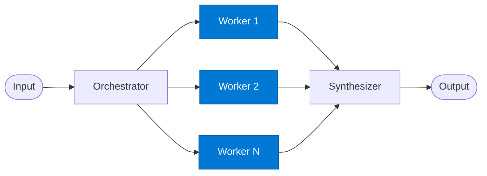

# Orchestrator Worker

_Executes one subtask assigned by the orchestrator and returns its result._

## Overview

The Orchestrator Worker is the **worker** role in the **orchestrator-workers** pattern. Anthropic's internal research shows this pattern achieves ~90% better performance than single-agent on complex multi-step tasks.

## Pattern Diagram



## Contract Specification

### Inputs
**subtask** (object, required): The subtask to execute  
**worker_index** (integer, optional): Worker assignment index  


### Outputs
**result** (object): Subtask output  
**subtask_id** (string): Subtask identifier for synthesizer correlation  


## Azure Tools

| Tool ID | Display Name | Service | Purpose in this role |
|---|---|---|---|
| `iq-foundry` | Foundry IQ | Indexed org knowledge via Azure AI Search | Ground subtask execution in org knowledge |
| `iq-fabric` | Fabric IQ | OneLake, Power BI semantic models and datasets | Execute data-oriented subtasks against OneLake |
| `iq-web` | Web IQ | Live public web and news via Bing grounding | Execute research-oriented subtasks using web search |


## Usage

```python
from safe_framework.safe_core.code_generator import RouteCodeGenerator
from safe_framework.safe_core.models import RouteDefinition, RoutePattern, Agent

route = RouteDefinition(
    name="my-route",
    pattern=RoutePattern.ORCHESTRATOR_WORKERS,
    agents={"worker": Agent(
        name="Worker",
        category="test",
        version="1.0",
        input_schema={"type": "object", "properties": {}},
        output_schema={"type": "object", "properties": {}},
    )},
    description="Example route using this role",
)
generated = RouteCodeGenerator.generate(route)
```

## Use Cases

1. **Financial sub-analysis**
2. **Regional data fetch**
3. **Competitive research subtask**


## Limitations

- Orchestrator decomposition quality determines overall output quality
- Workers are generic; for domain specialists use `mixture-of-experts` instead

## Related Roles

- **Orchestrator** decomposes → **Workers** execute → **Synthesizer** merges

---

**Status:** Production Ready  
**Version:** 1.0  
**Framework:** SAFE 1.0  
**Last Updated:** 2026-06-21
