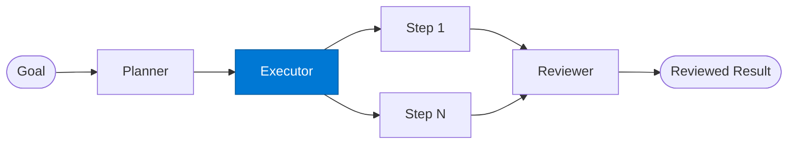

# Plan Executor

_Executes a single plan step and returns its outcome._

## Overview

The Plan Executor is the **executor** role in the **planning** pattern — where an explicit plan is produced before any execution begins, reducing errors on complex multi-step business processes.

## Pattern Diagram

## Contract Specification

### Inputs
**step** (object, required): Plan step to execute — includes id, action, inputs  
**context** (object, required): Original goal context  

### Outputs
**step_id** (string): Echo of input step ID  
**output** (object): Step execution result  
**success** (boolean): Whether the step completed successfully  

## Azure Tools

No external tools required for this role.

## Use Cases

1. **Data fetch steps**
2. **Document generation steps**
3. **API call steps**

## Limitations

- Plan quality determines execution quality — validate planner output on critical workflows
- Executor steps run sequentially; use `fan-out-fan-in` for parallelisable steps

## Related Roles

- **Planner** → **Executor** → **Reviewer** is the plan-execute-review chain

---

**Status:** Production Ready  
**Version:** 1.0  
**Framework:** SAFE 1.0  
**Last Updated:** 2026-06-21
