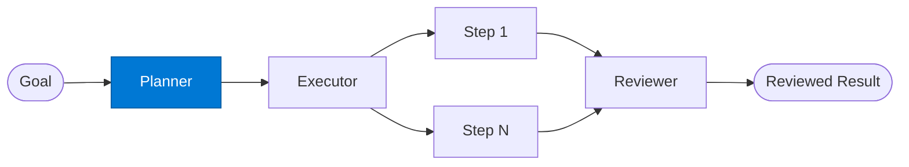

# Task Planner

_Produces an explicit step-by-step execution plan with dependencies before any work begins._

## Overview

The Task Planner is the **planner** role in the **planning** pattern — where an explicit plan is produced before any execution begins, reducing errors on complex multi-step business processes.

## Pattern Diagram



## Contract Specification

### Inputs
**goal** (string, required): High-level goal to plan  
**constraints** (object, optional): Deadline, budget, resource constraints  


### Outputs
**steps** (array): Ordered list of steps with IDs and dependencies  
**plan_id** (string): Plan identifier  
**estimated_duration_minutes** (integer): Estimated total duration  


## Azure Tools

| Tool ID | Display Name | Service | Purpose in this role |
|---|---|---|---|
| `iq-foundry` | Foundry IQ | Indexed org knowledge via Azure AI Search | Retrieve past plans and templates for similar goals |
| `iq-work` | Work IQ | M365 signals — meetings, chats, emails, documents | Understand org workflows, team capacity, and past execution history |


## Usage

```python
from safe_framework.safe_core.code_generator import RouteCodeGenerator
from safe_framework.safe_core.models import RouteDefinition, RoutePattern, Agent

route = RouteDefinition(
    name="my-route",
    pattern=RoutePattern.PLANNING,
    agents={"planner": Agent(
        name="Planner",
        category="test",
        version="1.0",
        input_schema={"type": "object", "properties": {}},
        output_schema={"type": "object", "properties": {}},
    )},
    description="Example route using this role",
)
generated = RouteCodeGenerator.generate(route)
```

## Use Cases

1. **RFP response planning**
2. **Project timeline generation**
3. **Incident response plan**


## Limitations

- Plan quality determines execution quality — validate planner output on critical workflows
- Executor steps run sequentially; use `fan-out-fan-in` for parallelisable steps

## Related Roles

- **Planner** → **Executor** → **Reviewer** is the plan-execute-review chain

---

**Status:** Production Ready  
**Version:** 1.0  
**Framework:** SAFE 1.0  
**Last Updated:** 2026-06-21
