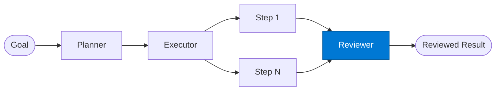

# Plan Reviewer

_Reviews plan execution results and validates that the goal was fully achieved._

## Overview

The Plan Reviewer is the **reviewer** role in the **planning** pattern — where an explicit plan is produced before any execution begins, reducing errors on complex multi-step business processes.

## Pattern Diagram

## Contract Specification

### Inputs
**plan** (object, required): The original plan  
**execution_results** (array, required): Results from each executed step  

### Outputs
**verdict** (string): 'complete' | 'partial' | 'failed'  
**coverage** (float): Fraction of steps that succeeded  
**gaps** (array): Steps that failed or were skipped  
**summary** (string): Human-readable execution summary  

## Azure Tools

| Tool ID | Display Name | Service | Purpose in this role |
|---|---|---|---|
| `iq-foundry` | Foundry IQ | Indexed org knowledge via Azure AI Search | Validate execution against known constraints and completion criteria |

## Use Cases

1. **Post-execution QA**
2. **Coverage reporting**
3. **Gap analysis**

## Limitations

- Plan quality determines execution quality — validate planner output on critical workflows
- Executor steps run sequentially; use `fan-out-fan-in` for parallelisable steps

## Related Roles

- **Planner** → **Executor** → **Reviewer** is the plan-execute-review chain

---

**Status:** Production Ready  
**Version:** 1.0  
**Framework:** SAFE 1.0  
**Last Updated:** 2026-06-21
