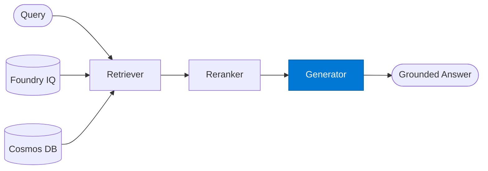

# RAG Generator

_Generates a grounded answer using only the provided context chunks._

## Overview

The RAG Generator is the **generator** role in the **rag** (retrieval-augmented generation) pattern — the foundational pattern for grounded enterprise Q&A.

## Pattern Diagram



## Contract Specification

### Inputs
**query** (string, required): Original user query  
**context_chunks** (array, required): Reranked context to ground the answer  


### Outputs
**answer** (string): Grounded answer  
**sources_used** (array): Chunks cited in the answer  
**confidence** (float): Answer confidence based on context quality  


## Azure Tools

No external tools required — pure LLM grounded generation.


## Usage

```python
from safe_framework.safe_core.code_generator import RouteCodeGenerator
from safe_framework.safe_core.models import RouteDefinition, RoutePattern, Agent

route = RouteDefinition(
    name="my-route",
    pattern=RoutePattern.RAG,
    agents={"generator": Agent(
        name="Generator",
        category="test",
        version="1.0",
        input_schema={"type": "object", "properties": {}},
        output_schema={"type": "object", "properties": {}},
    )},
    description="Example route using this role",
)
generated = RouteCodeGenerator.generate(route)
```

## Use Cases

1. **Policy Q&A**
2. **Document-grounded Q&A**
3. **Data-grounded NL query**


## Limitations

- Answer quality is bounded by retrieval quality
- Generator must not hallucinate beyond provided context chunks

## Related Roles

- **Retriever** → **Reranker** → **Generator** is the retrieval pipeline
- See also: `standalone/rag-query` for a single-agent RAG implementation

---

**Status:** Production Ready  
**Version:** 1.0  
**Framework:** SAFE 1.0  
**Last Updated:** 2026-06-21
