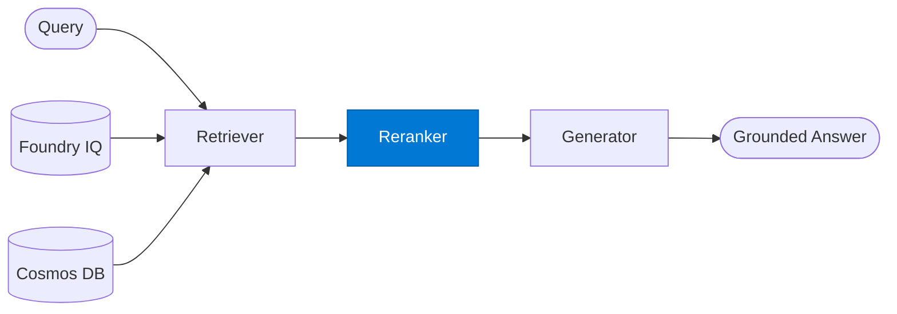

# RAG Reranker

_Re-ranks retrieved chunks by semantic relevance to the query._

## Overview

The RAG Reranker is the **reranker** role in the **rag** (retrieval-augmented generation) pattern — the foundational pattern for grounded enterprise Q&A.

## Pattern Diagram



## Contract Specification

### Inputs
**query** (string, required): Original query for relevance scoring  
**chunks** (array, required): Raw retrieved chunks from the retriever  


### Outputs
**ranked_chunks** (array): Chunks re-ordered by relevance score  
**top_k_used** (integer): Number of chunks passed to generator  


## Azure Tools

No external tools required — pure LLM grounded generation.


## Usage

```python
from safe_framework.safe_core.code_generator import RouteCodeGenerator
from safe_framework.safe_core.models import RouteDefinition, RoutePattern, Agent

route = RouteDefinition(
    name="my-route",
    pattern=RoutePattern.RAG,
    agents={"reranker": Agent(
        name="Reranker",
        category="test",
        version="1.0",
        input_schema={"type": "object", "properties": {}},
        output_schema={"type": "object", "properties": {}},
    )},
    description="Example route using this role",
)
generated = RouteCodeGenerator.generate(route)
```

## Use Cases

1. **Relevance improvement**
2. **Noise reduction**
3. **Context window optimisation**


## Limitations

- Answer quality is bounded by retrieval quality
- Generator must not hallucinate beyond provided context chunks

## Related Roles

- **Retriever** → **Reranker** → **Generator** is the retrieval pipeline
- See also: `standalone/rag-query` for a single-agent RAG implementation

---

**Status:** Production Ready  
**Version:** 1.0  
**Framework:** SAFE 1.0  
**Last Updated:** 2026-06-21
