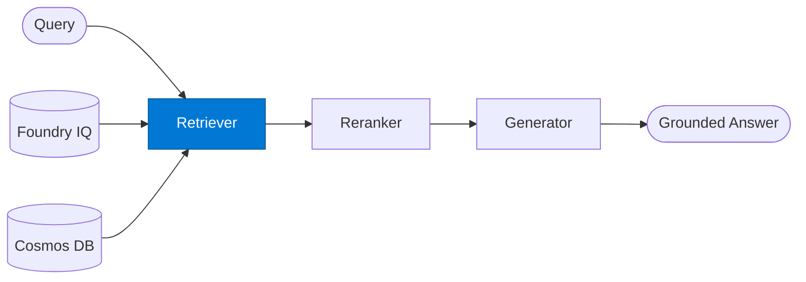

# RAG Retriever

_Queries one or more knowledge sources and returns the top matching document chunks._

## Overview

The RAG Retriever is the **retriever** role in the **rag** (retrieval-augmented generation) pattern — the foundational pattern for grounded enterprise Q&A.

## Pattern Diagram

## Contract Specification

### Inputs
**query** (string, required): Natural language query  
**sources** (array, optional): Knowledge sources to query  
**top_k** (integer, optional): Documents to retrieve (default: 10)  

### Outputs
**chunks** (array): Retrieved document chunks with scores  
**total_found** (integer): Total matching documents before top_k truncation  

## Azure Tools

| Tool ID | Display Name | Service | Purpose in this role |
|---|---|---|---|
| `iq-foundry` | Foundry IQ | Indexed org knowledge via Azure AI Search | Primary — Azure AI Search indexed org knowledge |
| `iq-work` | Work IQ | M365 signals — meetings, chats, emails, documents | Retrieve M365 content (emails, meetings, documents) |
| `iq-fabric` | Fabric IQ | OneLake, Power BI semantic models and datasets | Structured business data from OneLake / Power BI |
| `iq-web` | Web IQ | Live public web and news via Bing grounding | Public web retrieval via Bing grounding |
| `azure-cosmos-db` | Azure Cosmos DB | Vector + document store; hybrid search | Vector search over operational / transactional data |

## Use Cases

1. **Policy lookup**
2. **Meeting context retrieval**
3. **Operational data Q&A**

## Limitations

- Answer quality is bounded by retrieval quality
- Generator must not hallucinate beyond provided context chunks

## Related Roles

- **Retriever** → **Reranker** → **Generator** is the retrieval pipeline
- See also: `standalone/rag-query` for a single-agent RAG implementation

---

**Status:** Production Ready  
**Version:** 1.0  
**Framework:** SAFE 1.0  
**Last Updated:** 2026-06-21
