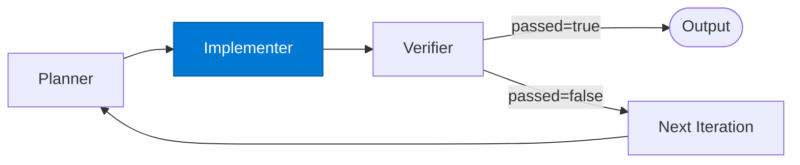

# Ralph Implementer

_Executes the task planned for this iteration and writes changes to the filesystem. Designed to be idempotent so subsequent iterations can safely extend or correct its work._

## Overview

The Implementer in the **ralph-loop** pattern performs the concrete work for each iteration: writing code, modifying documents, applying transforms, or executing any task whose result can be machine-verified. It does not check its own output — that is strictly the Verifier's job.

Because the Ralph loop resets context each iteration, the Implementer always receives a clean, self-contained `task` object from the Planner with all context it needs. It does not rely on prior conversation history.

## Pattern Diagram



## Contract Specification

### Inputs

**impl_request** (object, required):
- `task` (object, required): Structured task definition from the Planner
- `context` (object): Supporting context (file paths, relevant spec excerpts)
- `iteration` (integer, required): Current iteration index (0-based)

### Outputs

**impl_result** (object):
- `result` (object, required): Structured outcome of the implementation step
- `files_changed` (array): Filesystem paths written or modified
- `metadata` (object): Execution details (model, tokens, elapsed ms)

## Azure Tools

| Tool ID | Display Name | Service | Purpose in this role |
|---|---|---|---|
| `iq-foundry` | Foundry IQ | Indexed org knowledge via Azure AI Search | Ground implementation decisions in org knowledge and coding standards |
| `iq-work` | Work IQ | Past accepted work in Azure AI Search | Reference past accepted implementations for consistency |

## Usage

```python
from safe_framework.agents.patterns.ralph_loop.implementer import RalphImplementer

implementer = RalphImplementer(kernel=kernel)
result = await implementer.invoke({
    "task": {
        "id": "task-1",
        "description": "Implement user authentication endpoint",
        "acceptance_criteria": ["tests pass", "linter clean"],
    },
    "context": {"relevant_files": ["src/auth.py", "tests/test_auth.py"]},
    "iteration": 0,
})
# result["result"] → pass to Verifier
```

## Use Cases

1. **Autonomous coding** — write or modify source files to satisfy acceptance criteria
2. **Document generation** — draft compliance clauses or technical specs
3. **Data pipeline authoring** — implement a transform step from a manifest
4. **Refactoring** — apply a linter or type-checker fix

## Limitations

- Must be **idempotent** — the Verifier may reject output and the next iteration may re-run or extend this work
- Does not verify its own output; defer all correctness judgement to the Verifier
- Large tasks should be broken into sub-tasks by the Planner; the Implementer works best on bounded, single-session work

## Related Roles

- **Planner** — provides the `task` and `context` for each iteration
- **Verifier** — machine-checks the Implementer's output and feeds diagnostics back to the next iteration
- See also: `retry-loop/worker` for single-task retry; `orchestrator-workers/worker` for decomposed parallel execution

---

**Status:** Backlog (Templates + Docs Complete)
**Version:** 1.0
**Framework:** SAFE 1.0
**Last Updated:** 2026-06-21
