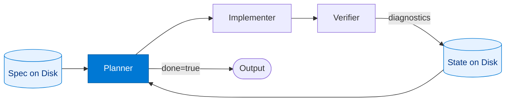

# Ralph Planner

_Reads the task spec and state fresh from disk at the start of every iteration — the deliberate context reset that defines the Ralph loop._

## Overview

The Planner in the **ralph-loop** pattern is the entry point for each iteration. It reads the task specification and current progress state directly from the filesystem rather than from conversation history. This is intentional: the context reset prevents "context rot" where accumulated history degrades LLM reasoning quality over many iterations.

The Planner selects one actionable task from the spec, packages the context the Implementer needs, and writes its intent to the state file so the next iteration can resume from where this one left off. When all spec items are satisfied it sets `done: true` to terminate the loop early.

## Pattern Diagram



## Contract Specification

### Inputs

**plan_request** (object, required):
- `spec_path` (string, required): Path to the task specification / TODO file on disk
- `state_path` (string, required): Path to the iteration state file on disk
- `iteration` (integer, required): Current iteration index (0-based)
- `previous_diagnostics` (array, optional): Verifier diagnostics from the previous iteration

### Outputs

**plan_output** (object):
- `done` (boolean, required): True when all spec items are complete; terminates the loop
- `next_task` (object): Structured task for this iteration (present when `done=false`)
- `context` (object): Supporting context for the Implementer (file paths, spec excerpts)
- `final_result` (object): Summary result returned when `done=true`

## Azure Tools

| Tool ID | Display Name | Service | Purpose in this role |
|---|---|---|---|
| `iq-foundry` | Foundry IQ | Indexed org knowledge via Azure AI Search | Ground spec interpretation in org knowledge base |
| `safe-durable-task` | SAFE Durable Task | Checkpoint / suspend / resume long-running workflows | Read and write durable iteration state between loop rounds |

## Usage

```python
from safe_framework.agents.patterns.ralph_loop.planner import RalphPlanner

planner = RalphPlanner(kernel=kernel)
plan = await planner.invoke({
    "spec_path": "/workspace/spec.md",
    "state_path": "/workspace/.ralph_state.json",
    "iteration": 0,
    "previous_diagnostics": [],
})
# plan["done"] == False → pass plan["next_task"] to Implementer
# plan["done"] == True  → loop terminates, return plan["final_result"]
```

## Use Cases

1. **Autonomous coding** — pick the next failing test to fix from a PRD
2. **Compliance generation** — select the next unchecked clause from a compliance checklist
3. **Iterative refactoring** — identify the next linter violation to resolve
4. **Data pipeline repair** — select the next broken transform step from a manifest

## Limitations

- The Planner does **not** carry in-memory state between iterations; this is intentional (Ralph loop invariant)
- Spec and state files must exist before the loop starts; the route controller is responsible for initialising them
- Task ordering is the Planner's responsibility; if tasks have dependencies the Planner must respect them

## Related Roles

- **Implementer** — receives the Planner's `next_task` and executes it
- **Verifier** — runs machine checks after the Implementer; its `diagnostics` flow back to the Planner on the next iteration
- See also: `retry-loop/worker` for single-task retry without context reset; `planning/planner` for within-session plan decomposition

---

**Status:** Backlog (Templates + Docs Complete)
**Version:** 1.0
**Framework:** SAFE 1.0
**Last Updated:** 2026-06-21
