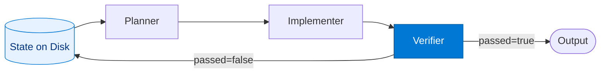

# Ralph Verifier

_Runs machine-verifiable checks after every Implementer turn. The `passed` boolean is the exit criterion for the entire loop._

## Overview

The Verifier in the **ralph-loop** pattern is the only agent allowed to terminate the loop successfully. It runs machine checks — test suites, linters, type checkers, compliance scanners — that produce an unambiguous `passed: true` or `passed: false`. This is the key distinction from similar patterns like `reflection` (LLM self-critique) or `evaluator-optimizer` (scored evaluation): the Verifier does not use LLM judgement to decide completion. It runs deterministic, external tools.

When `passed: false`, diagnostics are written to the state file on disk. The Planner reads these at the next iteration start to inform what to fix.

## Pattern Diagram



## Contract Specification

### Inputs

**verify_request** (object, required):
- `result` (object, required): The Implementer's output from this iteration
- `spec_path` (string, required): Path to the task spec (used to cross-check acceptance criteria)
- `iteration` (integer, required): Current iteration index (0-based)

### Outputs

**verify_output** (object):
- `passed` (boolean, required): True when all machine checks pass — **this terminates the Ralph loop**
- `diagnostics` (array): Failure messages / tool output (empty when `passed=true`)
- `checks_run` (array): Names of checks executed (e.g. `pytest`, `ruff`, `mypy`)
- `summary` (string): Human-readable verification outcome

## Azure Tools

| Tool ID | Display Name | Service | Purpose in this role |
|---|---|---|---|
| `safe-durable-task` | SAFE Durable Task | Checkpoint / suspend / resume long-running workflows | Write diagnostics to durable state so the Planner reads them on the next iteration |
| `iq-foundry` | Foundry IQ | Indexed org knowledge via Azure AI Search | Cross-check output against org standards and acceptance criteria in the knowledge base |

## Usage

```python
from safe_framework.agents.patterns.ralph_loop.verifier import RalphVerifier

verifier = RalphVerifier(kernel=kernel)
result = await verifier.invoke({
    "result": {"status": "implemented", "files_changed": ["src/auth.py"]},
    "spec_path": "/workspace/spec.md",
    "iteration": 0,
})
# result["passed"] == True  → loop exits, success
# result["passed"] == False → result["diagnostics"] flows back to Planner next iteration
```

## Use Cases

1. **Test gate** — run `pytest` / `jest`; `passed=true` when all tests green
2. **Lint gate** — run `ruff` / `eslint`; `passed=true` when zero violations
3. **Type gate** — run `mypy` / `tsc`; `passed=true` when zero errors
4. **Compliance gate** — run a policy scanner; `passed=true` when all clauses present

## Limitations

- Verification criteria are domain-specific and must be configured per route deployment
- Cannot guarantee semantic correctness beyond what the check suite covers
- External tool availability (test runner, linter) must be ensured in the execution environment

## Related Roles

- **Planner** — reads the Verifier's `diagnostics` at the start of the next iteration
- **Implementer** — the agent whose output the Verifier checks
- See also: `retry-loop/validator` for LLM-based validation within a single session; `gate-guard/guard` for pre-processing policy checks

---

**Status:** Backlog (Templates + Docs Complete)
**Version:** 1.0
**Framework:** SAFE 1.0
**Last Updated:** 2026-06-21
