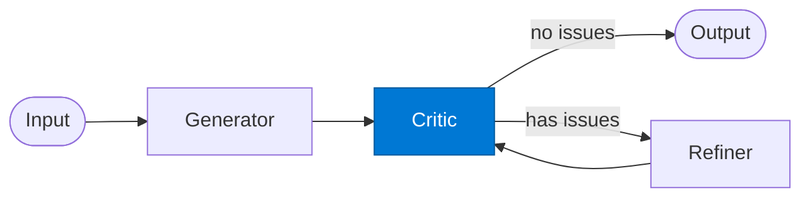

# Reflection Critic

_Critiques the draft against internal standards and returns structured improvement notes._

## Overview

The Reflection Critic is the **critic** role in the **reflection** pattern — a lightweight self-improvement loop where a single output is critiqued and refined before being returned.

## Pattern Diagram



## Contract Specification

### Inputs
**draft** (object, required): Draft to critique  
**original_request** (object, required): The original task  
**reflection** (integer, required): Reflection round number  


### Outputs
**no_issues** (boolean): True if draft needs no further improvement  
**issues** (array): List of specific issues found  
**suggestions** (array): Improvement suggestions  


## Azure Tools

| Tool ID | Display Name | Service | Purpose in this role |
|---|---|---|---|
| `iq-work` | Work IQ | M365 signals — meetings, chats, emails, documents | Compare against internal standards and past approved versions |


## Usage

```python
from safe_framework.safe_core.code_generator import RouteCodeGenerator
from safe_framework.safe_core.models import RouteDefinition, RoutePattern, Agent

route = RouteDefinition(
    name="my-route",
    pattern=RoutePattern.REFLECTION,
    agents={"critic": Agent(
        name="Critic",
        category="test",
        version="1.0",
        input_schema={"type": "object", "properties": {}},
        output_schema={"type": "object", "properties": {}},
    )},
    description="Example route using this role",
)
generated = RouteCodeGenerator.generate(route)
```

## Use Cases

1. **Quality assurance**
2. **Bias detection**
3. **Completeness check**


## Limitations

- `max_reflections` defaults to 2; increase only for high-stakes output
- Critic and Refiner must share the same output schema as Generator

## Related Roles

- **Generator** → **Critic** → **Refiner** form the self-improvement loop
- See also: `evaluator-optimizer` for quality-score-driven improvement with a separate optimizer

---

**Status:** Production Ready  
**Version:** 1.0  
**Framework:** SAFE 1.0  
**Last Updated:** 2026-06-21
