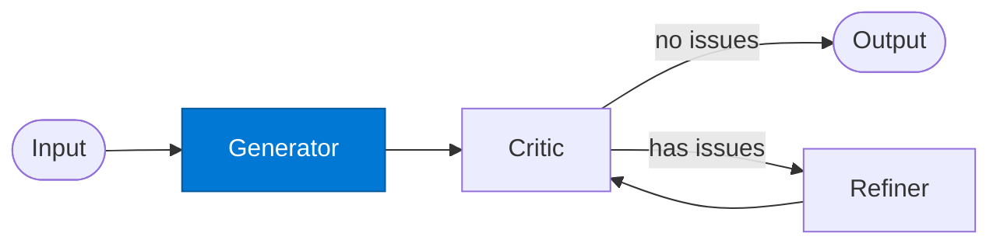

# Reflection Generator

_Produces the initial draft that will be critiqued and refined._

## Overview

The Reflection Generator is the **generator** role in the **reflection** pattern — a lightweight self-improvement loop where a single output is critiqued and refined before being returned.

## Pattern Diagram

## Contract Specification

### Inputs
**payload** (object, required): Task to generate from  
**context** (object, optional): Optional context  

### Outputs
**draft** (object): Initial generated output  

## Azure Tools

| Tool ID | Display Name | Service | Purpose in this role |
|---|---|---|---|
| `iq-foundry` | Foundry IQ | Indexed org knowledge via Azure AI Search | Ground initial draft in org knowledge |

## Use Cases

1. **First-draft reports**
2. **Initial code generation**
3. **Contract drafting**

## Limitations

- `max_reflections` defaults to 2; increase only for high-stakes output
- Critic and Refiner must share the same output schema as Generator

## Related Roles

- **Generator** → **Critic** → **Refiner** form the self-improvement loop
- See also: `evaluator-optimizer` for quality-score-driven improvement with a separate optimizer

---

**Status:** Production Ready  
**Version:** 1.0  
**Framework:** SAFE 1.0  
**Last Updated:** 2026-06-21
