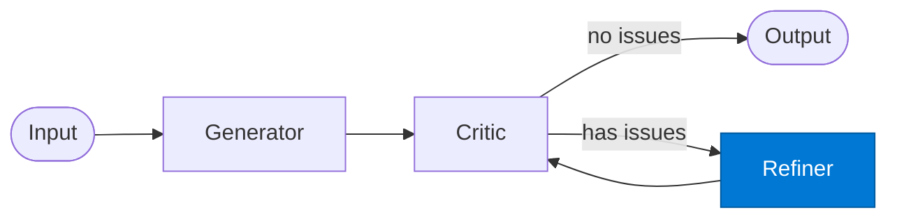

# Reflection Refiner

_Applies critic feedback to produce an improved version of the draft._

## Overview

The Reflection Refiner is the **refiner** role in the **reflection** pattern — a lightweight self-improvement loop where a single output is critiqued and refined before being returned.

## Pattern Diagram

## Contract Specification

### Inputs
**draft** (object, required): Current draft  
**critique** (object, required): Critic's issues and suggestions  
**reflection** (integer, required): Reflection round number  

### Outputs
**draft** (object): Improved draft  
**changes_made** (array): Summary of changes applied  

## Azure Tools

No external tools required — pure LLM refinement.

## Use Cases

1. **Tone improvement**
2. **Compliance fix-up**
3. **Clarity enhancement**

## Limitations

- `max_reflections` defaults to 2; increase only for high-stakes output
- Critic and Refiner must share the same output schema as Generator

## Related Roles

- **Generator** → **Critic** → **Refiner** form the self-improvement loop
- See also: `evaluator-optimizer` for quality-score-driven improvement with a separate optimizer

---

**Status:** Production Ready  
**Version:** 1.0  
**Framework:** SAFE 1.0  
**Last Updated:** 2026-06-21
