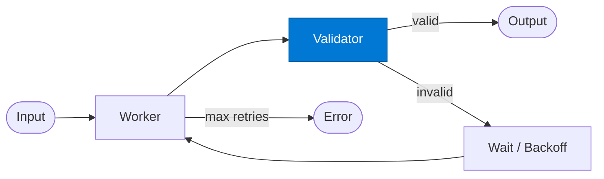

# Output Validator

_Evaluates each worker attempt and decides whether to accept or retry._

## Overview

The Validator is the gatekeeper of the **retry-loop** pattern. It receives the worker's output and checks it against a quality rubric — completeness, compliance, format correctness, or business rules. It returns `valid: true` to break the loop or `valid: false` with actionable feedback to guide the next attempt.

## Pattern Diagram



## Contract Specification

### Inputs

**validation_request** (object, required):
- `result` (any, required): Worker output to validate
- `attempt` (integer): Which attempt this is
- `rubric` (string, optional): Override the default validation rubric

### Outputs

**validation_output** (object):
- `valid` (boolean, required): `true` → accept; `false` → retry
- `score` (float): Quality score 0.0–1.0
- `failures` (array): List of specific validation failures (empty if `valid: true`)
- `suggestions` (array): Actionable feedback for the next attempt

## Azure Tools

| Tool ID | Display Name | Service | Purpose in this role |
|---|---|---|---|
| `iq-foundry` | Foundry IQ | Indexed org knowledge via Azure AI Search | Validate output against known-good patterns from the knowledge base |
| `iq-work` | Work IQ | M365 signals — meetings, chats, emails, documents | Compare output against org quality standards and past accepted outputs |

## Usage

```python
from safe_framework.agents.patterns.retry_loop.validator import OutputValidator

validator = OutputValidator(kernel=kernel)
verdict = await validator.invoke({
    "result": worker_output,
    "attempt": 1
})

if verdict["valid"]:
    return worker_output
else:
    print(verdict["failures"])  # e.g. ["missing_signature_block", "non_compliant_clause_3"]
```

## Use Cases

1. **Compliance validation** — reject outputs missing mandatory legal language
2. **Format checking** — ensure output matches a required JSON schema
3. **Completeness checking** — verify all required sections are present in a report
4. **Quality scoring** — only accept outputs scoring above a threshold

## Limitations

- Validator feedback quality determines retry improvement; vague failures lead to identical retries
- Validators that are too strict can cause max-retry exhaustion on legitimate outputs

## Related Roles

- **Worker** — produces the outputs this validator evaluates
- Together, Worker + Validator form the core retry loop

---

**Status:** Production Ready  
**Version:** 1.0  
**Framework:** SAFE 1.0  
**Last Updated:** 2026-06-21
