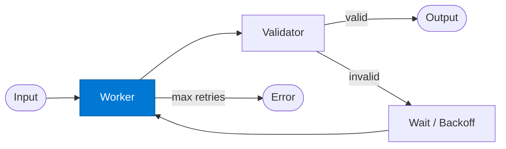

# Retry Worker

_Attempts the task; is re-invoked with exponential backoff until validation passes._

## Overview

The Worker in the **retry-loop** pattern performs the primary task and returns its best attempt. If the Validator rejects the result, the route automatically retries the Worker after a backoff delay. State is checkpointed via SAFE Durable Task so a crash does not restart from attempt 1.

## Pattern Diagram



## Contract Specification

### Inputs

**attempt_request** (object, required):
- `payload` (any, required): The task to perform
- `attempt` (integer): Current attempt number (0-based)
- `previous_failure` (object, optional): Validator feedback from the last attempt

### Outputs

**attempt_result** (object):
- `result` (any, required): The worker's output for this attempt
- `attempt` (integer): Echo of input attempt number
- `metadata` (object): Execution details (model used, tokens, elapsed ms)

## Azure Tools

| Tool ID | Display Name | Service | Purpose in this role |
|---|---|---|---|
| `iq-foundry` | Foundry IQ | Indexed org knowledge via Azure AI Search | Ground each attempt in the same knowledge base |
| `safe-durable-task` | SAFE Durable Task | Checkpoint / suspend / resume long-running workflows | Checkpoint state between retries so a restart doesn't lose progress |

## Usage

```python
from safe_framework.agents.patterns.retry_loop.worker import RetryWorker

worker = RetryWorker(kernel=kernel)
result = await worker.invoke({
    "payload": {"task": "Generate a compliant contract clause"},
    "attempt": 0,
    "previous_failure": None
})
```

## Use Cases

1. **Code generation** — retry until generated code passes linting and tests
2. **Contract drafting** — retry until the clause meets all compliance rules
3. **Data extraction** — retry until all required fields are present in the output
4. **Report generation** — retry until the report meets a quality threshold

## Limitations

- The worker does not track its own history — `previous_failure` must be passed in from the route
- Maximum retries is set in `route.py.jinja2` as `max_retries`; default is 3

## Related Roles

- **Validator** — evaluates this worker's output and triggers or terminates the retry loop
- See also: `fallback-chain/primary` for switching to an alternative agent on failure

---

**Status:** Production Ready  
**Version:** 1.0  
**Framework:** SAFE 1.0  
**Last Updated:** 2026-06-21
