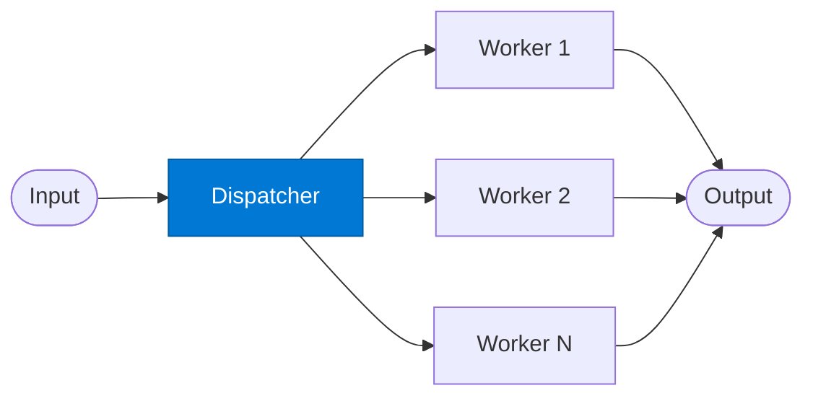

# Round-Robin Dispatcher

_Routes each request to the next available worker in a rotating sequence._

## Overview

The Dispatcher maintains a stateful counter and assigns each incoming request to the next worker in a fixed rotation. This ensures even load distribution across a pool of identical workers. State is persisted in Azure Cosmos DB so the counter survives restarts and multi-process deployments.

## Pattern Diagram



## Contract Specification

### Inputs

**request** (object, required):
- `payload` (any, required): The request to dispatch
- `session_id` (string, optional): Client session for affinity tracking
- `worker_count` (integer, optional): Override the registered worker pool size

### Outputs

**dispatch_result** (object):
- `assigned_worker` (string, required): Worker key selected for this request
- `worker_index` (integer): 0-based index in the rotation
- `payload` (any): Original payload forwarded unchanged
- `counter` (integer): Updated global dispatch counter

## Azure Tools

| Tool ID | Display Name | Service | Purpose in this role |
|---|---|---|---|
| `safe-token-metrics` | SAFE Token Metrics | Granular per-request token cost tracking | Track worker cost per turn to weight dispatch toward under-used workers |
| `azure-cosmos-db` | Azure Cosmos DB | Vector + document store; hybrid search | Persist the round-robin counter across sessions and process restarts |

## Usage

```python
from safe_framework.agents.patterns.round_robin.dispatcher import RoundRobinDispatcher

dispatcher = RoundRobinDispatcher(kernel=kernel, worker_count=3)
result = await dispatcher.invoke({
    "payload": {"query": "Summarise this document"},
    "session_id": "sess-abc"
})
print(result["assigned_worker"])  # e.g. "worker_1"
```

## Use Cases

1. **Load-balanced inference** — distribute LLM requests evenly across model deployments
2. **Multi-region processing** — rotate requests across region-specific worker agents
3. **Fair scheduling** — prevent any single worker from being overwhelmed

## Limitations

- Pure round-robin does not account for variable worker latency
- Affinity (same session → same worker) requires additional logic in the dispatcher
- Cosmos DB persistence adds ~10–30 ms per dispatch

## Related Roles

- **Worker** — executes the actual task; receives the dispatched payload
- See also: `mixture-of-experts/router` for capability-weighted routing

---

**Status:** Production Ready  
**Version:** 1.0  
**Framework:** SAFE 1.0  
**Last Updated:** 2026-06-21
