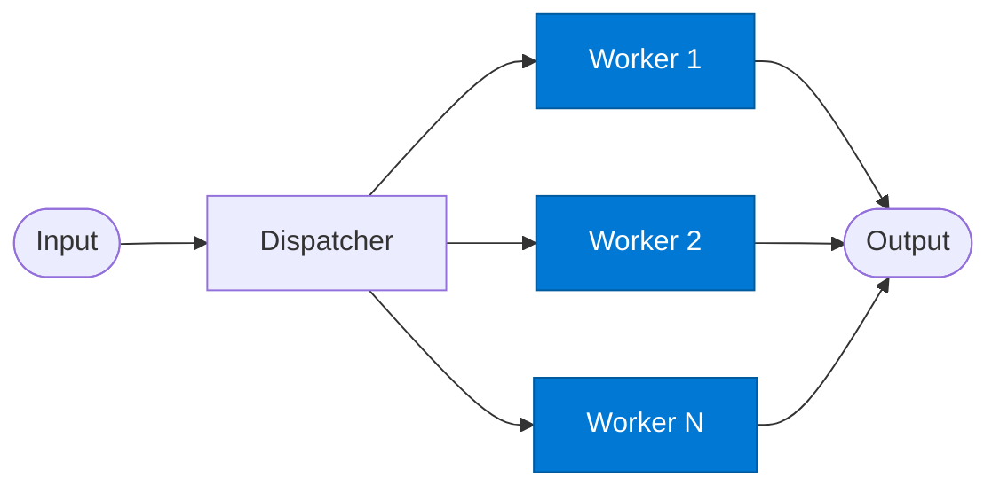

# Round-Robin Worker

_Executes the assigned task for a single rotation slot._

## Overview

The Worker in the **round-robin** pattern is stateless and interchangeable. All workers in the pool are identical — they perform the same task on whatever payload is assigned to them. The dispatcher ensures balanced utilisation; the worker simply executes and returns.

## Pattern Diagram



## Contract Specification

### Inputs

**dispatch_result** (object, required):
- `assigned_worker` (string): This worker's key (for self-identification in logs)
- `payload` (any, required): The work to perform
- `worker_index` (integer): Position in the pool

### Outputs

**worker_result** (object):
- `result` (any, required): Task output
- `worker_key` (string): Which worker processed this request
- `status` (string): `"success"` | `"error"`

## Azure Tools

| Tool ID | Display Name | Service | Purpose in this role |
|---|---|---|---|
| `iq-foundry` | Foundry IQ | Indexed org knowledge via Azure AI Search | Each worker independently grounded in the shared knowledge base |

## Usage

```python
from safe_framework.agents.patterns.round_robin.worker import RoundRobinWorker

worker = RoundRobinWorker(kernel=kernel, worker_key="worker_1")
result = await worker.invoke(dispatch_result)
```

## Use Cases

1. **Parallel summarisation pool** — multiple identical summariser workers
2. **Translation fleet** — rotate across translation workers to balance quota consumption
3. **Embedding generation** — distribute embedding requests across Azure OpenAI deployments

## Limitations

- Workers are identical — routing is positional, not capability-based
- Workers cannot communicate with each other
- For heterogeneous workers, use `mixture-of-experts` instead

## Related Roles

- **Dispatcher** — assigns requests to this worker
- See also: `fan-out-fan-in/worker` for parallel (non-rotating) workers

---

**Status:** Production Ready  
**Version:** 1.0  
**Framework:** SAFE 1.0  
**Last Updated:** 2026-06-21
