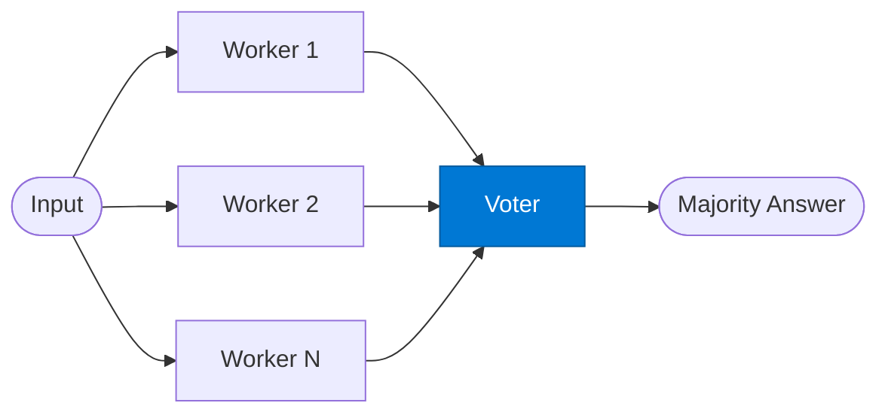

# SC Voter

_Aggregates N independent worker answers and selects the majority or weighted consensus._

## Overview

The SC Voter is the **voter** role in the **self-consistency** pattern — run the same prompt N times in parallel and vote on the majority answer. Increases accuracy for factual or numerical tasks at the cost of more tokens.

## Pattern Diagram

## Contract Specification

### Inputs
**worker_results** (array, required): All worker answers with confidence scores  
**question** (string, required): Original question for context  

### Outputs
**answer** (any): Majority / consensus answer  
**vote_distribution** (object): Count of votes per unique answer  
**confidence** (float): Fraction of workers that agreed on the winning answer  

## Azure Tools

No external tools required — statistical aggregation only.

## Use Cases

1. **Majority vote**
2. **Weighted confidence aggregation**
3. **Outlier detection**

## Limitations

- Cost scales linearly with N workers — use only for high-accuracy requirements
- Works best for questions with a single correct answer; poor for open-ended creative tasks

## Related Roles

- **Workers** (×N) run in parallel → **Voter** selects majority answer
- See also: `debate` for two opposing positions rather than N identical attempts

---

**Status:** Production Ready  
**Version:** 1.0  
**Framework:** SAFE 1.0  
**Last Updated:** 2026-06-21
