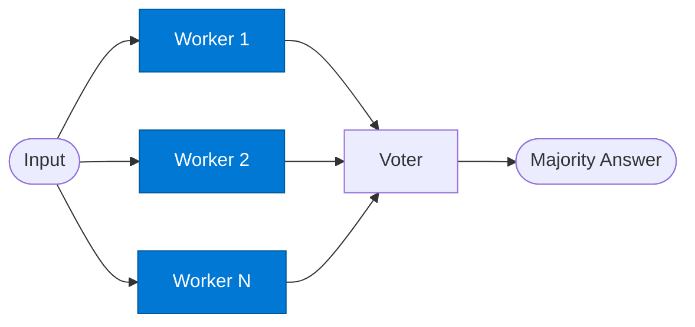

# SC Worker

_Independently answers the same question — one of N parallel identical workers used for voting._

## Overview

The SC Worker is the **worker** role in the **self-consistency** pattern — run the same prompt N times in parallel and vote on the majority answer. Increases accuracy for factual or numerical tasks at the cost of more tokens.

## Pattern Diagram

## Contract Specification

### Inputs
**question** (string, required): The question or task to answer  
**context** (object, optional): Optional grounding context  

### Outputs
**answer** (any): This worker's answer  
**confidence** (float): Worker self-assessed confidence 0.0–1.0  

## Azure Tools

| Tool ID | Display Name | Service | Purpose in this role |
|---|---|---|---|
| `iq-foundry` | Foundry IQ | Indexed org knowledge via Azure AI Search | Each worker independently grounded in the same knowledge base |

## Use Cases

1. **Factual verification**
2. **Numerical answer checking**
3. **Classification consistency**

## Limitations

- Cost scales linearly with N workers — use only for high-accuracy requirements
- Works best for questions with a single correct answer; poor for open-ended creative tasks

## Related Roles

- **Workers** (×N) run in parallel → **Voter** selects majority answer
- See also: `debate` for two opposing positions rather than N identical attempts

---

**Status:** Production Ready  
**Version:** 1.0  
**Framework:** SAFE 1.0  
**Last Updated:** 2026-06-21
