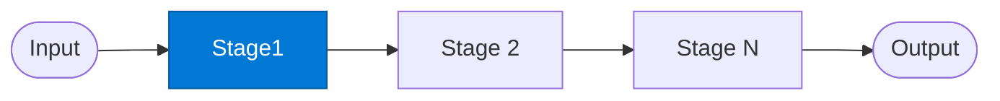

# Pipeline Stage

_Performs one transformation step and passes enriched data to the next stage._

## Overview

The Stage agent is the repeatable unit of the **sequential-pipeline** pattern. Each stage receives its predecessor's output, applies its specific transformation, enrichment, or validation, and passes the result forward. The first stage (`stage1`) is responsible for fetching and normalising the raw input; subsequent stages progressively enrich it.

## Pattern Diagram



## Contract Specification

### Inputs

**pipeline_state** (object, required):
- `stage` (string, required): Current stage name (e.g. `"stage1"`)
- `payload` (any, required): Data to process at this stage
- `metadata` (object, optional): Accumulated metadata from previous stages

### Outputs

**pipeline_state** (object) — same shape, enriched:
- `stage` (string): This stage's name
- `payload` (any): Transformed data to pass to the next stage
- `metadata` (object): Metadata updated with this stage's contribution
- `elapsed_ms` (integer): Processing time for this stage

## Azure Tools

| Tool ID | Display Name | Service | Purpose in this role |
|---|---|---|---|
| `iq-foundry` | Foundry IQ | Indexed org knowledge via Azure AI Search | Retrieve source documents to kick off the pipeline |
| `iq-work` | Work IQ | M365 signals — meetings, chats, emails, documents | Retrieve M365 source content (emails, meetings, documents) |
| `iq-fabric` | Fabric IQ | OneLake, Power BI semantic models and datasets | Retrieve structured data from OneLake as pipeline input |

## Usage

```python
from safe_framework.agents.patterns.sequential_pipeline.stage1 import PipelineStage

# First stage — fetches and normalises input
stage1 = PipelineStage(kernel=kernel, stage_name="stage1")
state = await stage1.invoke({
    "stage": "stage1",
    "payload": {"query": "Q2 sales report"},
    "metadata": {}
})

# Second stage — enriches the output
stage2 = PipelineStage(kernel=kernel, stage_name="stage2")
state = await stage2.invoke(state)
```

## Use Cases

1. **ETL pipelines** — fetch → clean → transform → validate → load
2. **Report generation** — gather → analyse → draft → format → export
3. **Document review** — ingest → classify → extract → summarise → approve
4. **Data enrichment** — read → enrich with Fabric IQ → validate → persist

## Limitations

- Stages are strictly sequential — no parallel execution within the pipeline
- Each stage must pass through the full `pipeline_state` object unchanged (except its own additions)
- A failed stage halts the entire pipeline unless the route configures a fallback

## Related Roles

- Stage agents form a chain; each instance plays the same role at a different position
- See also: `supervisor-manager` for conditional branching between stages
- See also: `diamond` for a pipeline that forks and rejoins

---

**Status:** Production Ready  
**Version:** 1.0  
**Framework:** SAFE 1.0  
**Last Updated:** 2026-06-21
