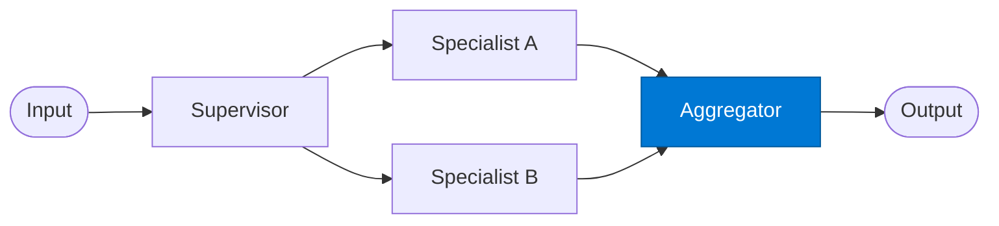

# Result Aggregator

_Merges specialist outputs into a single, validated final response._

## Overview

The Aggregator is the final stage of the **supervisor-manager** pattern. It receives the output from whichever specialist was invoked, applies any cross-cutting validation or enrichment, and returns the canonical response to the caller.

## Pattern Diagram



## Contract Specification

### Inputs

**specialist_result** (object, required):
- `data` (object, required): Specialist output payload
- `specialist` (string): Which specialist produced this result
- `execution_time_ms` (integer, optional): Specialist execution time

### Outputs

**final_result** (object):
- `result` (object, required): Validated and enriched output
- `source_specialist` (string): Specialist that handled the request
- `status` (string): `"success"` | `"partial"` | `"degraded"`
- `metadata` (object): Timestamps, token counts, routing path

## Azure Tools

| Tool ID | Display Name | Service | Purpose in this role |
|---|---|---|---|
| `iq-foundry` | Foundry IQ | Indexed org knowledge via Azure AI Search | Validate combined specialist outputs against known outcome patterns and policies |

## Usage

```python
from safe_framework.agents.patterns.supervisor_manager.aggregator import ResultAggregator

agent = ResultAggregator(kernel=kernel)
result = await agent.invoke({
    "data": specialist_output,
    "specialist": "analytics_specialist",
    "execution_time_ms": 1240
})
```

## Use Cases

1. **Audit trail enrichment** — stamp routing path and timing onto every response
2. **Output normalisation** — ensure all specialists return a consistent schema
3. **Policy validation** — block responses that violate output policies before returning to caller
4. **Degraded-mode handling** — return a `partial` result when specialist output is incomplete

## Limitations

- Has no view of the original routing decision unless it is passed through in the specialist result
- Cannot re-route to a different specialist — use the route's `fallback_agent` config for that

## Related Roles

- **Supervisor** — precedes this role; provides routing context
- **Specialist agents** — their output is this role's input
- See also: `fan-out-fan-in/aggregator` for multi-result merging

---

**Status:** Production Ready  
**Version:** 1.0  
**Framework:** SAFE 1.0  
**Last Updated:** 2026-06-21
