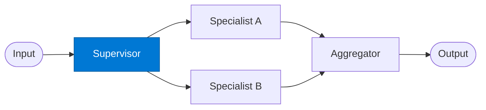

# Supervisor Router

_Examines incoming requests and routes them to the appropriate specialist agent._

## Overview

The Supervisor Router is the entry point of the **supervisor-manager** pattern. It reads the incoming request, determines which specialist can best handle it, and emits a routing decision. No domain work is done here — the supervisor is purely a classifier and dispatcher.

## Pattern Diagram



## Contract Specification

### Inputs

**request** (object, required) — the raw incoming request:
- `input_text` (string, required): The query or task description
- `context` (object, optional): Additional context (user info, priority, history)
- `user_id` (string, optional): Originating user identifier

### Outputs

**routing_decision** (object):
- `specialist` (string, required): Key of the selected specialist agent
- `confidence` (float): Routing confidence score 0.0–1.0
- `reasoning` (string): Human-readable explanation of the routing choice
- `request` (object): Original request forwarded to the specialist

## Azure Tools

| Tool ID | Display Name | Service | Purpose in this role |
|---|---|---|---|
| `iq-foundry` | Foundry IQ | Indexed org knowledge via Azure AI Search | Retrieve routing rules and specialist capability descriptions |
| `iq-work` | Work IQ | M365 signals — meetings, chats, emails, documents | Understand org context — ownership, past routing decisions, escalation history |

## Usage

```python
from safe_framework.agents.patterns.supervisor_manager.supervisor import SupervisorRouter

agent = SupervisorRouter(kernel=kernel)
result = await agent.invoke({
    "input_text": "Analyse Q2 sales performance across EMEA",
    "context": {"team": "sales", "priority": "high"},
    "user_id": "u-12345"
})
# result["specialist"] → "analytics_specialist"
```

## Use Cases

1. **Multi-domain helpdesk** — route tickets to HR, IT, or Finance specialists automatically
2. **Document processing** — classify documents and send to the correct extraction specialist
3. **Customer support** — triage support requests to the right product team
4. **Compliance routing** — route audit queries to legal, risk, or data-privacy specialists

## Limitations

- Routing accuracy depends on the quality of capability descriptions in Foundry IQ
- Does not execute domain work — delegates entirely to specialists
- A misrouted request will still succeed if the fallback logic in the aggregator handles it

## Related Roles

- **Specialist agents** — receive the routed request from this supervisor
- **Aggregator** — combines specialist output into the final response
- See also: `mixture-of-experts/router` for weighted multi-expert routing

---

**Status:** Production Ready  
**Version:** 1.0  
**Framework:** SAFE 1.0  
**Last Updated:** 2026-06-21
