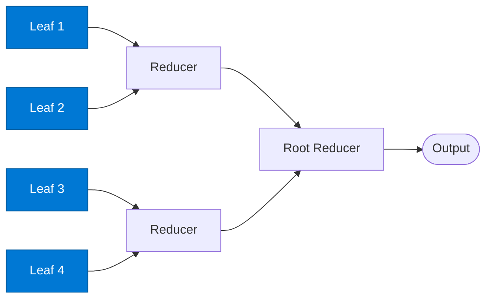

# Leaf Processor

_Processes a single input item at the bottom of the reduction tree._

## Overview

Leaf agents are the base-level workers in the **tree-reduce** pattern. Each leaf receives one atomic item, performs its analysis, and returns a `(key, value)` pair that propagates up the tree to a parent Reducer. Leaf agents run in parallel across all items.

## Pattern Diagram



## Contract Specification

### Inputs

**leaf_item** (object, required):
- `item_id` (string, required): Unique ID for this leaf
- `payload` (any, required): The single item to process
- `tree_depth` (integer, optional): Depth of this leaf in the tree (informational)

### Outputs

**leaf_result** (object):
- `item_id` (string): Echo for tree correlation
- `key` (string, required): Grouping key for the parent reducer
- `value` (any, required): Processed result from this leaf
- `depth` (integer): `0` (always for leaves)

## Azure Tools

| Tool ID | Display Name | Service | Purpose in this role |
|---|---|---|---|
| `iq-foundry` | Foundry IQ | Indexed org knowledge via Azure AI Search | Each leaf grounded in org knowledge for its individual item |
| `iq-fabric` | Fabric IQ | OneLake, Power BI semantic models and datasets | When leaves are processing individual data records from OneLake |

## Usage

```python
from safe_framework.agents.patterns.tree_reduce.leaf import LeafProcessor
import asyncio

leaf = LeafProcessor(kernel=kernel)
results = await asyncio.gather(*[
    leaf.invoke({"item_id": f"item-{i}", "payload": item})
    for i, item in enumerate(items)
])
```

## Use Cases

1. **Document summarisation tree** — each leaf summarises one paragraph; reducers merge summaries
2. **Hierarchical classification** — classify individual records before reducing to category counts
3. **Bill of Materials** — analyse individual components before rolling up to assembly costs

## Limitations

- Leaves are stateless and independent
- Key assignment at the leaf level determines which reducer receives each result — plan key distribution carefully

## Related Roles

- **Reducer** — parent node that aggregates leaf results

---

**Status:** Production Ready  
**Version:** 1.0  
**Framework:** SAFE 1.0  
**Last Updated:** 2026-06-21
