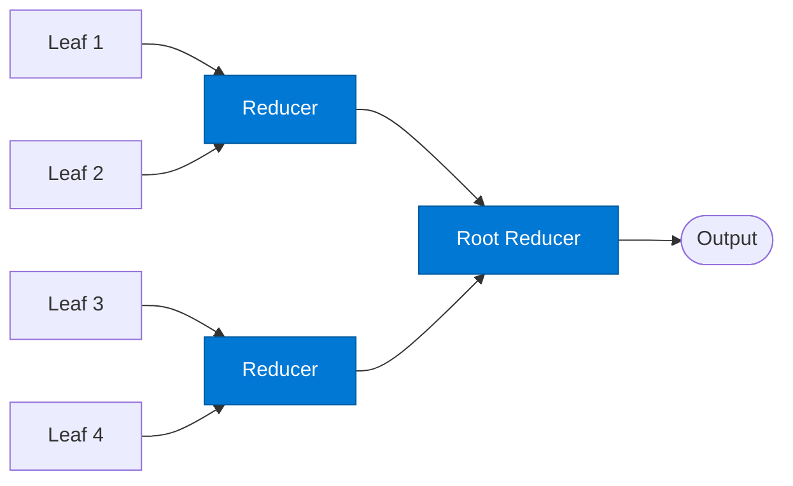

# Tree Reducer

_Aggregates child results at each internal node of the reduction tree._

## Overview

Reducer agents operate at every non-leaf level of the **tree-reduce** pattern. Each reducer collects results from its children (leaves or lower-level reducers), aggregates them, and passes the reduced result to its own parent. The root reducer produces the final output.

## Pattern Diagram



## Contract Specification

### Inputs

**child_results** (array, required):
- Each element: `{ "item_id": str, "key": str, "value": any, "depth": integer }`
- `parent_key` (string): The key this reducer is responsible for

### Outputs

**reduced_result** (object):
- `key` (string): Matches `parent_key`
- `result` (any, required): Aggregated value from all children
- `child_count` (integer): Number of children aggregated
- `depth` (integer): This reducer's level in the tree (root = highest)

## Azure Tools

| Tool ID | Display Name | Service | Purpose in this role |
|---|---|---|---|
| `iq-foundry` | Foundry IQ | Indexed org knowledge via Azure AI Search | Validate each reduction step against known business rules |
| `azure-cosmos-db` | Azure Cosmos DB | Vector + document store; hybrid search | Persist intermediate reduction results for large trees spanning multiple invocations |

## Usage

```python
from safe_framework.agents.patterns.tree_reduce.reducer import TreeReducer

reducer = TreeReducer(kernel=kernel, level=1)
result = await reducer.invoke({
    "child_results": leaf_results[:4],
    "parent_key": "section_1"
})
```

## Use Cases

1. **Multi-level summarisation** — paragraph → section → chapter → document summary
2. **Hierarchical cost roll-up** — component → sub-assembly → assembly → total BOM cost
3. **Recursive classification** — item → group → category → domain

## Limitations

- The tree structure must be defined before execution begins — dynamic tree reshaping is not supported
- Intermediate results should be persisted in Cosmos DB for large trees that may span multiple executions

## Related Roles

- **Leaf** — provides base-level results that this reducer aggregates
- The root reducer is the same agent type — just the last reducer in the chain

---

**Status:** Production Ready  
**Version:** 1.0  
**Framework:** SAFE 1.0  
**Last Updated:** 2026-06-21
