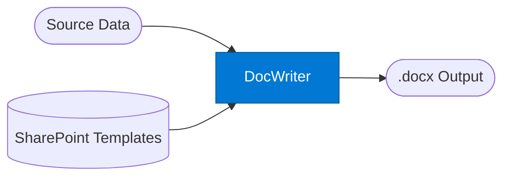

# Document Writer Agent

_Generates professional Word documents (.docx) from structured data._

## Overview

The Document Writer agent accepts a document structure (title, sections, formatting preferences) and produces a fully formatted .docx file. It is ideal for reports, contracts, proposals, and client deliverables. It can pull templates from SharePoint via Work IQ and source content from Foundry IQ before generating the document.

## Pattern Diagram



## Contract Specification

### Inputs

**document_data** (object, required):
- `title` (string, required): Document title
- `author` (string, optional): Author name
- `subject` (string, optional): Document subject
- `sections` (array, required): Document sections
  - `heading` (string): Section heading
  - `content` (string): Section body (Markdown or plain text)
  - `style` (string): `"normal"` | `"highlight"` | `"note"` | `"code"`
  - `include_page_break` (boolean): Start a new page before this section

### Outputs

**document** (object):
- `filename` (string): Suggested filename
- `content_base64` (string): Base64-encoded .docx file content
- `size_bytes` (integer): File size in bytes
- `page_count` (integer): Estimated page count
- `metadata` (object): Generation metadata (timestamp, agent version)

## Azure Tools

| Tool ID | Display Name | Service | Purpose |
|---|---|---|---|
| `iq-work` | Work IQ | M365 signals — meetings, chats, emails, documents | Pull org Word templates and branding from SharePoint before generating |
| `iq-foundry` | Foundry IQ | Indexed org knowledge via Azure AI Search | Retrieve source content / data to populate document sections |

## Usage

```python
import base64
from safe_framework.agents.standalone.document_writer import DocumentWriter

agent = DocumentWriter(kernel=kernel)
result = await agent.invoke({
    "document_data": {
        "title": "Q2 2026 Sales Report",
        "author": "Sales Team",
        "sections": [
            {
                "heading": "Executive Summary",
                "content": "Strong Q2 growth in all regions.",
                "style": "highlight"
            },
            {
                "heading": "Regional Breakdown",
                "content": "EMEA: +18%  APAC: +22%  Americas: +15%",
                "style": "normal",
                "include_page_break": True
            }
        ]
    }
})

if result["status"] == "success":
    with open(result["document"]["filename"], "wb") as f:
        f.write(base64.b64decode(result["document"]["content_base64"]))
```

## Use Cases

1. **Client reports** — generate branded reports using SharePoint templates
2. **Contract generation** — create standardised contracts from structured clause data
3. **Proposal documents** — professional proposals with section styling
4. **Analysis exports** — export agent-generated analysis as an executive-ready document
5. **Meeting follow-ups** — generate action-item summaries from Work IQ meeting transcripts

## Limitations

- Output is .docx only; use Presenter agents for HTML, Markdown, or code output formats
- Very large documents (100+ pages) may exceed generation time limits — split across multiple calls
- Complex tables and embedded charts are not supported — add these manually after generation

## Error Handling

If generation fails, the agent returns:
```json
{
  "status": "error",
  "error": "missing_required_field",
  "message": "document_data.sections is required and must be non-empty"
}
```

## Related Agents

- `presenter-word` — similar but optimised for presentation-style Word output
- `presenter-markdown` — Markdown output instead of .docx
- `presenter-html` — HTML/dashboard output

---

**Status:** Production Ready  
**Version:** 1.0  
**Framework:** SAFE 1.0  
**Last Updated:** 2026-06-21
