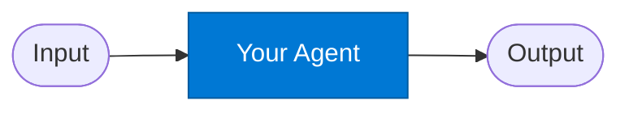

# Empty Agent (Scaffold)

_A minimal starter template for building new standalone agents._

## Overview

The Empty Agent is a scaffold — a copy-paste starting point for building a new agent. It demonstrates the minimum required structure: a `name`, `version`, `category`, `contract` with typed inputs and outputs, and metadata. Clone it with `safe agent new <name>` to get started.

## Pattern Diagram



## Contract Specification

### Inputs

**input_param** (object, required):
- `field1` (string, required): Replace with your actual input field

### Outputs

**output_param** (object):
- `result` (string): Replace with your actual output field

## Azure Tools

No tools are configured by default. Add tools to `agent.yaml` under the `tools:` key:

```yaml
tools:
  - id: iq-foundry
    purpose: "Describe what this agent uses Foundry IQ for"
```

Available tool IDs: `iq-foundry`, `iq-work`, `iq-fabric`, `iq-web`, `azure-cosmos-db`,
`safe-durable-task`, `safe-model-router`, `safe-token-metrics`.

## Usage

```python
from safe_framework.agents.standalone.empty_agent import EmptyAgent

agent = EmptyAgent(kernel=kernel)
result = await agent.invoke({"field1": "example value"})
```

## Customisation Checklist

1. Rename the agent directory and class
2. Update `agent.yaml` — `name`, `description`, `contract`, `tools`
3. Update `agent.py` — implement `invoke()` with real logic
4. Update this `agent.md` — replace placeholder content
5. Run `safe agent validate <name>` to verify the contract

## Related Agents

- All standalone agents in this directory are built from this template
- Use `safe agent new <name>` to clone with scaffolding pre-filled

---

**Status:** Scaffold / Template
**Version:** 1.0
**Framework:** SAFE 1.0
**Last Updated:** 2026-06-21
