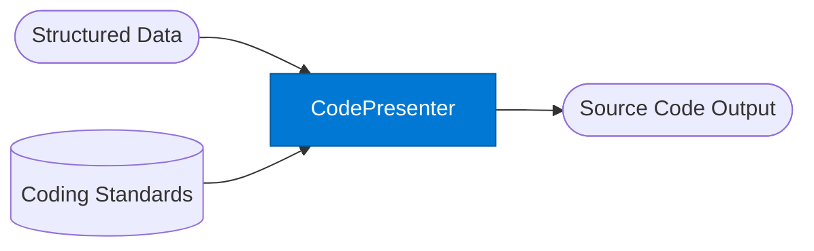

# Presenter: Code

_Formats agent output as clean, annotated source code._

## Overview

The Code Presenter takes structured data or analysis and renders it as formatted source code — Python, TypeScript, SQL, YAML, JSON, or any target language. It applies internal coding standards from Foundry IQ and retrieves approved patterns from SharePoint, ensuring generated code follows org conventions.

## Pattern Diagram



## Contract Specification

### Inputs

**presentation_request** (object, required):
- `content` (any, required): Data or analysis to render as code
- `language` (string, required): Target language — `"python"` | `"typescript"` | `"sql"` | `"yaml"` | `"json"`
- `style` (string, optional): `"minimal"` | `"annotated"` | `"production"` (default: `"annotated"`)
- `include_tests` (boolean, optional): Generate unit tests alongside code (default: false)

### Outputs

**code_output** (object):
- `code` (string, required): The formatted source code
- `language` (string): Echo of input language
- `filename_suggestion` (string): Suggested filename with correct extension
- `test_code` (string, optional): Generated test code when `include_tests: true`
- `line_count` (integer)

## Azure Tools

| Tool ID | Display Name | Service | Purpose |
|---|---|---|---|
| `iq-foundry` | Foundry IQ | Indexed org knowledge via Azure AI Search | Retrieve internal coding standards, style guides, and approved patterns |
| `iq-work` | Work IQ | M365 signals — meetings, chats, emails, documents | Pull approved code examples from internal SharePoint repositories |

## Usage

```python
from safe_framework.agents.standalone.presenter_code import PresenterCode

agent = PresenterCode(kernel=kernel)
result = await agent.invoke({
    "content": {"entities": ["Customer", "Order", "Product"], "relationships": ["has_many", "belongs_to"]},
    "language": "python",
    "style": "production",
    "include_tests": True
})

print(result["code"])
```

## Use Cases

1. **Schema generation** — convert a data model spec into Python dataclasses or TypeScript interfaces
2. **Query generation** — generate SQL queries from natural language data requests
3. **Config generation** — render agent config as YAML from a structured definition
4. **Test scaffolding** — generate test files from a function signature

## Limitations

- Generated code must be reviewed before execution in production environments
- Language-specific linting is not applied — run linters after generation
- Complex business logic cannot be inferred from data alone — provide explicit instructions in `content`

## Related Agents

- `presenter-html` — HTML / dashboard output format
- `presenter-markdown` — Markdown output format
- `presenter-word` — Word document output format
- `document-writer` — full .docx document generation

---

**Status:** Production Ready  
**Version:** 1.0  
**Framework:** SAFE 1.0  
**Last Updated:** 2026-06-21
