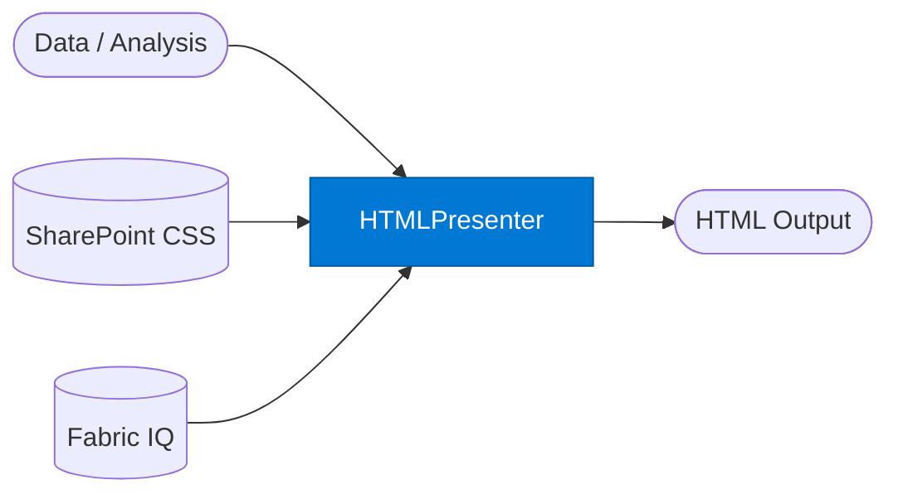

# Presenter: HTML

_Renders agent output as interactive HTML dashboards or pages._

## Overview

The HTML Presenter converts structured data or analysis into a self-contained HTML file — suitable for dashboards, reports, or email-ready summaries. It retrieves org CSS templates and branding from SharePoint and can embed live Power BI visuals sourced from Fabric IQ.

## Pattern Diagram



## Contract Specification

### Inputs

**presentation_request** (object, required):
- `content` (any, required): Data or narrative to render
- `template` (string, optional): SharePoint template key (default: org default)
- `title` (string, optional): Page/dashboard title
- `include_charts` (boolean, optional): Embed chart elements (default: false)
- `embed_power_bi` (boolean, optional): Embed a Fabric IQ Power BI visual (default: false)
- `power_bi_report_id` (string, optional): Required when `embed_power_bi: true`

### Outputs

**html_output** (object):
- `html` (string, required): Complete HTML document (self-contained)
- `filename_suggestion` (string): e.g. `"dashboard_2026_q2.html"`
- `assets_embedded` (boolean): `true` if CSS/JS are inline
- `size_bytes` (integer)

## Azure Tools

| Tool ID | Display Name | Service | Purpose |
|---|---|---|---|
| `iq-work` | Work IQ | M365 signals — meetings, chats, emails, documents | Retrieve org branding, CSS templates, and approved layouts from SharePoint |
| `iq-foundry` | Foundry IQ | Indexed org knowledge via Azure AI Search | Source data and content for dashboard components |
| `iq-fabric` | Fabric IQ | OneLake, Power BI semantic models and datasets | Embed live Power BI visuals or OneLake data into the HTML output |

## Usage

```python
from safe_framework.agents.standalone.presenter_html import PresenterHTML

agent = PresenterHTML(kernel=kernel)
result = await agent.invoke({
    "content": {"kpis": [{"label": "Revenue", "value": "$4.2M", "delta": "+18%"}]},
    "title": "Q2 KPI Dashboard",
    "include_charts": True
})

with open(result["filename_suggestion"], "w") as f:
    f.write(result["html"])
```

## Use Cases

1. **KPI dashboards** — render live KPIs with trend indicators as shareable HTML
2. **Email summaries** — produce inline HTML suitable for email body insertion
3. **Status reports** — auto-generate branded status pages from pipeline output
4. **Power BI embedding** — wrap a Fabric IQ report in a branded HTML shell

## Limitations

- Self-contained HTML only; no server-side rendering or live data binding
- Power BI embedding requires `power_bi_report_id` and appropriate Fabric IQ permissions
- Very complex interactive dashboards should be built in Fabric IQ directly

## Related Agents

- `presenter-code` — source code output
- `presenter-markdown` — Markdown output
- `presenter-word` — Word document output

---

**Status:** Production Ready  
**Version:** 1.0  
**Framework:** SAFE 1.0  
**Last Updated:** 2026-06-21
