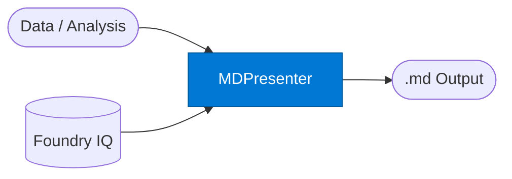

# Presenter: Markdown

_Renders agent output as structured Markdown for wikis, READMEs, and documentation._

## Overview

The Markdown Presenter formats structured data or prose analysis as clean GitHub-flavored Markdown. It retrieves org Markdown templates and style conventions from Foundry IQ to ensure output follows internal documentation standards. Output is ready for Confluence, GitHub, Azure DevOps wikis, or direct file storage.

## Pattern Diagram



## Contract Specification

### Inputs

**presentation_request** (object, required):
- `content` (any, required): Structured data or prose to format
- `output_type` (string, optional): `"readme"` | `"wiki"` | `"report"` | `"spec"` (default: `"report"`)
- `include_toc` (boolean, optional): Prepend a table of contents (default: false)
- `heading_level` (integer, optional): Top-level heading depth 1–3 (default: 1)

### Outputs

**markdown_output** (object):
- `markdown` (string, required): The formatted Markdown text
- `filename_suggestion` (string): e.g. `"q2_report.md"`
- `word_count` (integer)
- `section_count` (integer)

## Azure Tools

| Tool ID | Display Name | Service | Purpose |
|---|---|---|---|
| `iq-foundry` | Foundry IQ | Indexed org knowledge via Azure AI Search | Retrieve org Markdown templates and style conventions |

## Usage

```python
from safe_framework.agents.standalone.presenter_markdown import PresenterMarkdown

agent = PresenterMarkdown(kernel=kernel)
result = await agent.invoke({
    "content": analysis_output,
    "output_type": "wiki",
    "include_toc": True
})

print(result["markdown"])
```

## Use Cases

1. **Auto-documentation** — generate README files from code analysis output
2. **Wiki articles** — create Confluence / Azure DevOps wiki pages from structured specs
3. **Release notes** — format change logs and release notes from commit data
4. **Meeting summaries** — convert Work IQ meeting transcripts to structured Markdown

## Limitations

- Markdown only — use `presenter-html` for rendered output or `document-writer` for .docx
- Does not upload to Confluence or GitHub directly — use a subsequent automation step

## Related Agents

- `presenter-html` — rendered HTML output
- `presenter-word` — Word document output
- `presenter-code` — source code output

---

**Status:** Production Ready  
**Version:** 1.0  
**Framework:** SAFE 1.0  
**Last Updated:** 2026-06-21
