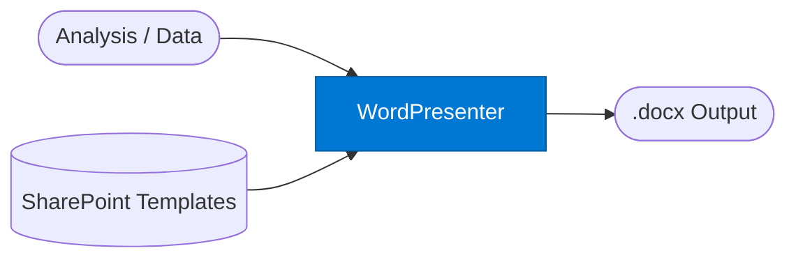

# Presenter: Word

_Renders agent output as a branded Word document using org-approved templates._

## Overview

The Word Presenter is a presentation-optimised Word document generator. Unlike the Document Writer (which accepts fine-grained section control), the Word Presenter accepts a high-level narrative or structured analysis and applies an org template automatically — ideal for quick one-shot document generation where formatting is secondary to content quality.

## Pattern Diagram



## Contract Specification

### Inputs

**presentation_request** (object, required):
- `content` (any, required): Analysis, narrative, or structured data to present
- `template_key` (string, optional): SharePoint template to apply (default: org default)
- `title` (string, optional): Document title
- `audience` (string, optional): `"executive"` | `"technical"` | `"client"` — adjusts tone

### Outputs

**word_output** (object):
- `filename` (string): Suggested .docx filename
- `content_base64` (string): Base64-encoded .docx file
- `size_bytes` (integer)
- `template_applied` (string): Name of the template used

## Azure Tools

| Tool ID | Display Name | Service | Purpose |
|---|---|---|---|
| `iq-work` | Work IQ | M365 signals — meetings, chats, emails, documents | Pull org-approved Word templates from SharePoint |
| `iq-foundry` | Foundry IQ | Indexed org knowledge via Azure AI Search | Retrieve structured source content to populate the document |

## Usage

```python
import base64
from safe_framework.agents.standalone.presenter_word import PresenterWord

agent = PresenterWord(kernel=kernel)
result = await agent.invoke({
    "content": analysis_result,
    "title": "Strategic Options — EMEA Expansion",
    "audience": "executive",
    "template_key": "exec_brief"
})

with open(result["filename"], "wb") as f:
    f.write(base64.b64decode(result["content_base64"]))
```

## Use Cases

1. **Executive briefs** — convert agent analysis into a formatted exec brief in one call
2. **Client deliverables** — apply client-specific Word templates to agent-generated content
3. **RFP responses** — render structured proposal data as a bid document

## Limitations

- Less control over section structure than `document-writer` — use that for fine-grained layout
- Template selection requires the template to exist in the SharePoint library linked to Work IQ

## Related Agents

- `document-writer` — fine-grained .docx generation with explicit section control
- `presenter-html` — HTML / dashboard output
- `presenter-markdown` — Markdown output

---

**Status:** Production Ready  
**Version:** 1.0  
**Framework:** SAFE 1.0  
**Last Updated:** 2026-06-21
