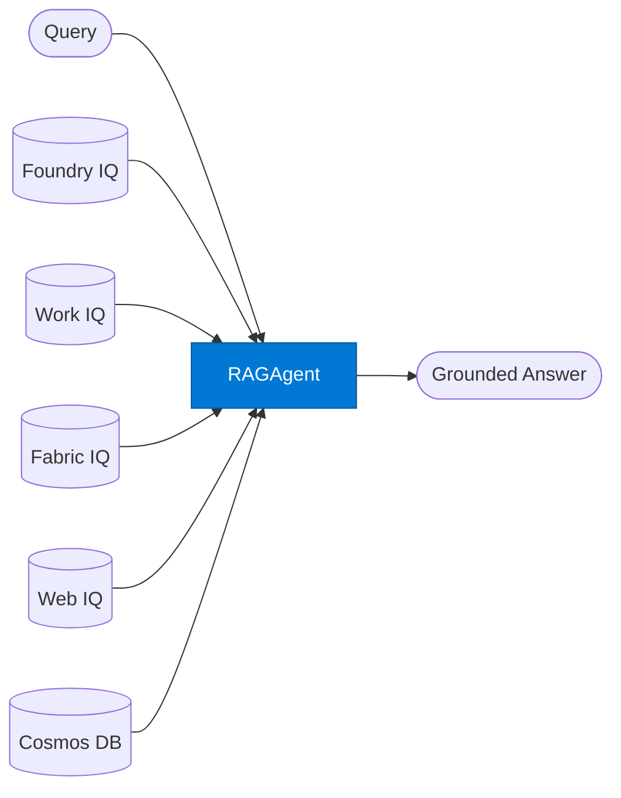

# RAG Query Agent

_Retrieval-augmented generation for grounded question answering over org knowledge._

## Overview

The RAG Query agent retrieves relevant documents from one or more knowledge sources, then generates a grounded answer using only the retrieved context. It supports multi-source retrieval — Foundry IQ for indexed org docs, Work IQ for M365 content, Fabric IQ for structured data, Web IQ for public information, and Cosmos DB for operational data.

## Pattern Diagram



## Contract Specification

### Inputs

**rag_request** (object, required):
- `query` (string, required): Natural language question
- `sources` (array, optional): Sources to query — any of `["foundry", "work", "fabric", "web", "cosmos"]` (default: `["foundry"]`)
- `top_k` (integer, optional): Documents to retrieve per source (default: 5)
- `filters` (object, optional): Source-specific metadata filters

### Outputs

**rag_response** (object):
- `answer` (string, required): Grounded answer synthesised from retrieved documents
- `sources_used` (array): List of source documents with titles and URLs/IDs
- `confidence` (float): Confidence score based on retrieval quality
- `retrieved_chunks` (integer): Total number of chunks retrieved across all sources

## Azure Tools

| Tool ID | Display Name | Service | Purpose |
|---|---|---|---|
| `iq-foundry` | Foundry IQ | Indexed org knowledge via Azure AI Search | Primary — indexes org docs via Azure AI Search; core function of this agent |
| `iq-work` | Work IQ | M365 signals — meetings, chats, emails, documents | Extend retrieval to M365 content (meetings, emails, Teams chats) |
| `iq-fabric` | Fabric IQ | OneLake, Power BI semantic models and datasets | Extend retrieval to structured business data in OneLake / Power BI |
| `iq-web` | Web IQ | Live public web and news via Bing grounding | Fallback or augmentation when internal knowledge is insufficient |
| `azure-cosmos-db` | Azure Cosmos DB | Vector + document store; hybrid search | Vector search over operational / transactional data |

## Usage

```python
from safe_framework.agents.standalone.rag_query import RAGQueryAgent

agent = RAGQueryAgent(kernel=kernel)
result = await agent.invoke({
    "query": "What is the approved vendor selection process for EMEA contracts over €500k?",
    "sources": ["foundry", "work"],
    "top_k": 8
})

print(result["answer"])
print(f"Sources: {[s['title'] for s in result['sources_used']]}")
```

## Use Cases

1. **Policy Q&A** — answer questions about HR, procurement, or legal policies from internal docs
2. **Meeting context** — retrieve and summarise relevant past meeting notes on a topic
3. **Business intelligence Q&A** — query Power BI data in natural language via Fabric IQ
4. **Hybrid internal/external** — combine org knowledge with live web search
5. **Customer data Q&A** — answer questions grounded in operational Cosmos DB records

## Limitations

- Answer quality is bounded by retrieval quality — poor indexing leads to poor answers
- Very large documents are chunked; answers may miss information outside retrieved chunks
- Web IQ retrieval may return stale or inaccurate public information — validate for high-stakes use

## Related Agents

- `semantic-search` — returns ranked documents instead of generating an answer
- `researcher` — multi-step research with synthesis, not just single-round retrieval
- `summarizer` — summarises retrieved documents rather than answering a specific question

---

**Status:** Production Ready  
**Version:** 1.0  
**Framework:** SAFE 1.0  
**Last Updated:** 2026-06-21
