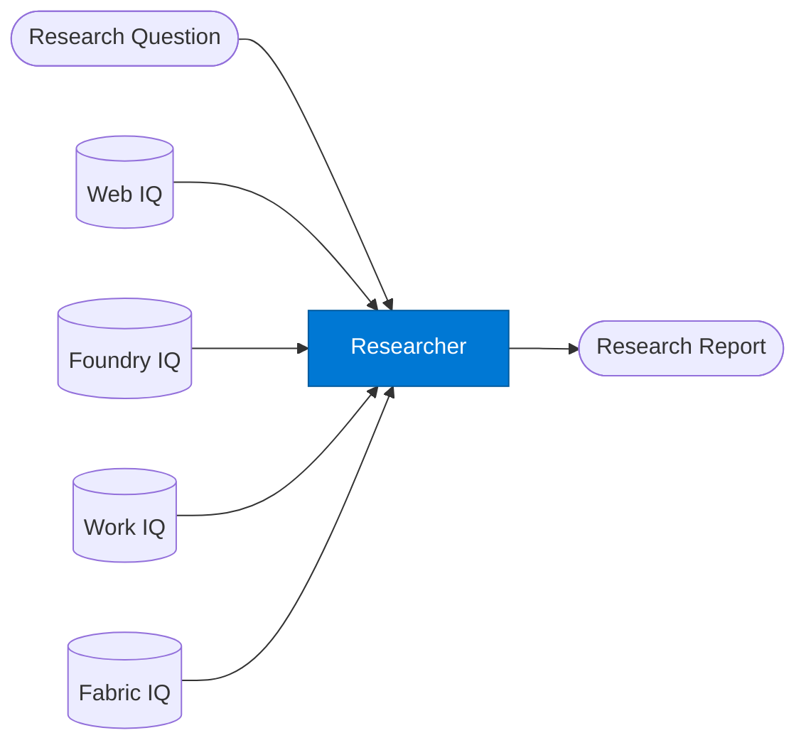

# Research Agent

_Multi-step research that synthesises internal and external sources into a structured report._

## Overview

The Research Agent performs iterative, multi-hop research. It formulates sub-questions, retrieves evidence from multiple sources (primarily Web IQ for external and Foundry IQ for internal), evaluates relevance, and synthesises findings into a structured research report. It is appropriate for open-ended questions that require breadth across many sources.

## Pattern Diagram



## Contract Specification

### Inputs

**research_request** (object, required):
- `question` (string, required): The research question to investigate
- `depth` (string, optional): `"brief"` | `"standard"` | `"deep"` (default: `"standard"`)
- `sources` (array, optional): Preferred sources — `["web", "foundry", "work", "fabric"]`
- `max_hops` (integer, optional): Maximum iterative retrieval rounds (default: 3)
- `output_format` (string, optional): `"prose"` | `"bullets"` | `"structured"` (default: `"structured"`)

### Outputs

**research_report** (object):
- `summary` (string, required): Executive summary of findings
- `findings` (array): Structured list of findings with supporting evidence
- `sources` (array): All sources consulted with titles, dates, and relevance scores
- `confidence` (float): Overall confidence in the research quality
- `follow_up_questions` (array): Suggested questions for deeper investigation

## Azure Tools

| Tool ID | Display Name | Service | Purpose |
|---|---|---|---|
| `iq-web` | Web IQ | Live public web and news via Bing grounding | Primary — live web and news search for external research via Bing grounding |
| `iq-foundry` | Foundry IQ | Indexed org knowledge via Azure AI Search | Internal knowledge base for org-specific context and validation |
| `iq-work` | Work IQ | M365 signals — meetings, chats, emails, documents | Search past internal projects, meeting notes, and decisions |
| `iq-fabric` | Fabric IQ | OneLake, Power BI semantic models and datasets | Pull business data to support or validate research findings |

## Usage

```python
from safe_framework.agents.standalone.researcher import ResearchAgent

agent = ResearchAgent(kernel=kernel)
report = await agent.invoke({
    "question": "What are the key regulatory trends affecting AI deployment in financial services in 2026?",
    "depth": "deep",
    "sources": ["web", "foundry"],
    "max_hops": 4
})

print(report["summary"])
for finding in report["findings"]:
    print(f"- {finding['finding']}")
```

## Use Cases

1. **Market research** — investigate competitive landscape, industry trends, or technology adoption
2. **Regulatory monitoring** — track changes in compliance requirements across jurisdictions
3. **Due diligence** — gather external information on a target company or technology
4. **Policy research** — synthesise internal policy docs with external best-practice guidance

## Limitations

- `depth: "deep"` with many hops is expensive — monitor token usage with SAFE Token Metrics
- Web IQ results are time-bounded; set `depth: "brief"` for time-sensitive queries
- The agent may generate `follow_up_questions` but will not automatically pursue them

## Related Agents

- `rag-query` — single-round retrieval for specific known-answer questions
- `semantic-search` — returns ranked documents, no synthesis
- `summarizer` — summarises a given document rather than researching a question

---

**Status:** Production Ready  
**Version:** 1.0  
**Framework:** SAFE 1.0  
**Last Updated:** 2026-06-21
