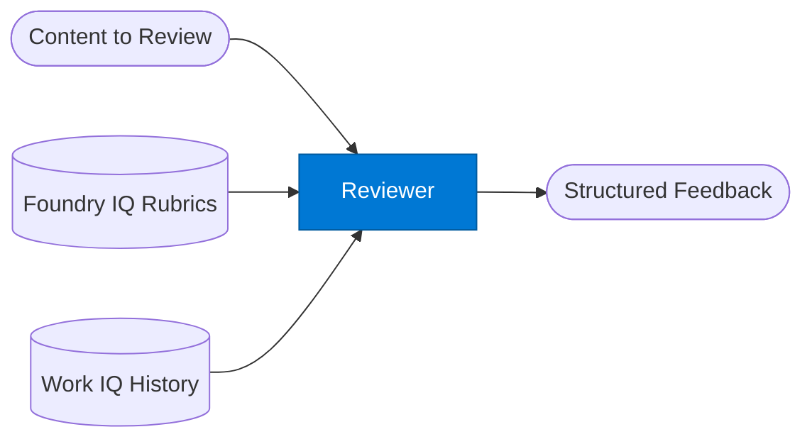

# Reviewer Agent

_Reviews documents, code, or outputs against a rubric and returns structured feedback._

## Overview

The Reviewer agent applies a quality rubric to any submitted content — contracts, code, reports, proposals, or agent outputs. It retrieves the relevant review rubric from Foundry IQ (compliance standards, coding guidelines, style guides) and compares the input against past approved versions in SharePoint. It returns structured feedback with pass/fail verdicts per criterion and actionable improvement suggestions.

## Pattern Diagram



## Contract Specification

### Inputs

**review_request** (object, required):
- `content` (string | object, required): Content to review
- `content_type` (string, required): `"contract"` | `"code"` | `"report"` | `"proposal"` | `"agent_output"`
- `rubric_key` (string, optional): Override the default rubric (default: auto-selected by `content_type`)
- `strict_mode` (boolean, optional): Fail on any minor issue (default: false)

### Outputs

**review_result** (object):
- `verdict` (string, required): `"pass"` | `"pass_with_comments"` | `"fail"`
- `score` (float): Overall quality score 0.0–1.0
- `criteria` (array): Per-criterion results — `{ "criterion": str, "passed": bool, "comment": str }`
- `suggestions` (array): Prioritised improvement actions
- `blocking_issues` (array): Issues that must be fixed before approval (empty if verdict is `"pass"`)

## Azure Tools

| Tool ID | Display Name | Service | Purpose |
|---|---|---|---|
| `iq-foundry` | Foundry IQ | Indexed org knowledge via Azure AI Search | Retrieve review rubrics, compliance standards, and past review outcomes |
| `iq-work` | Work IQ | M365 signals — meetings, chats, emails, documents | Compare against org review history and approved versions in SharePoint |

## Usage

```python
from safe_framework.agents.standalone.reviewer import ReviewerAgent

agent = ReviewerAgent(kernel=kernel)
result = await agent.invoke({
    "content": contract_text,
    "content_type": "contract",
    "rubric_key": "emea_procurement_contract_v2"
})

if result["verdict"] == "fail":
    for issue in result["blocking_issues"]:
        print(f"BLOCKING: {issue}")
```

## Use Cases

1. **Contract review** — check contracts against legal rubrics before signing
2. **Code review** — validate generated code against security and style standards
3. **Report quality gate** — ensure reports meet completeness and accuracy criteria before delivery
4. **Agent output validation** — use as a standalone validator before publishing agent results

## Limitations

- Rubric quality determines review accuracy — update rubrics in Foundry IQ regularly
- Cannot auto-apply fixes — it returns suggestions only; use a generator agent to implement them
- `strict_mode` may produce excessive noise on drafts; use it for final review only

## Related Agents

- `retry-loop/validator` — same concept embedded in a retry pattern
- `rag-query` — retrieve rubric content for custom review logic
- `document-writer` — generates the documents this agent reviews

---

**Status:** Production Ready  
**Version:** 1.0  
**Framework:** SAFE 1.0  
**Last Updated:** 2026-06-21
